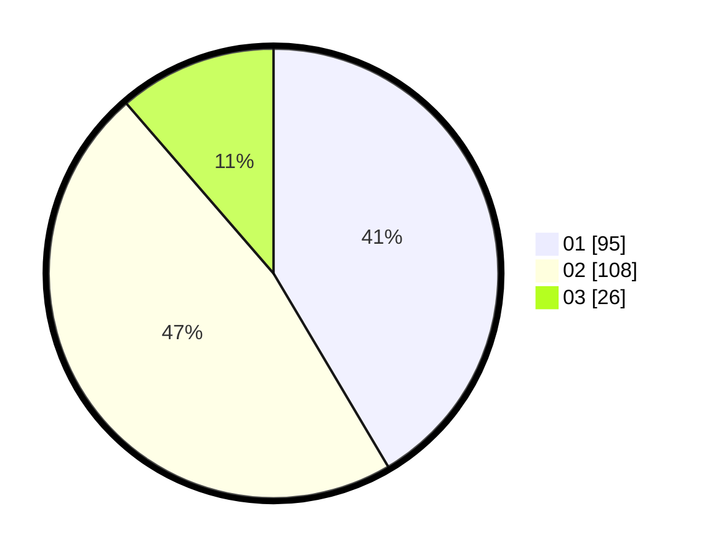

# Hasil

Hasil perolehan suara paslon dapat dilihat pada file paslon-01.txt, paslon-02.txt, dan paslon-03.txt.

Jika tidak ada, artinya data tersebut belum ada pada SIREKAP.

## Perolehan Suara

 * Paslon 01: **95**.
 * Paslon 02: **108**.
 * Paslon 03: **26**.

## Foto C Plano

https://sirekap-obj-formc.kpu.go.id/0f64/pemilu/ppwp/31/74/09/10/02/3174091002001-20240214-200841--b299db96-887d-43f4-95f0-102cfa5a785c.jpg

https://sirekap-obj-formc.kpu.go.id/0f64/pemilu/ppwp/31/74/09/10/02/3174091002001-20240214-200945--3d8a10c0-4cdd-450c-9be5-d3dd0891d095.jpg

https://sirekap-obj-formc.kpu.go.id/0f64/pemilu/ppwp/31/74/09/10/02/3174091002001-20240214-195112--b67c005d-9a68-4a63-8b73-8f4dd0b7ac5e.jpg

## DATA PEMILIH TETAP

Jumlah pemilih dalam DPT: **274**.
 * L: **136**.
 * P: **138**.

## DATA PENGGUNA HAK PILIH

Jumlah pengguna hak pilih dalam DPT: **231**.
 * L: **115**.
 * P: **116**.

Jumlah pengguna hak pilih dalam DPTb: **1**.
 * L: **0**.
 * P: **1**.

Jumlah pengguna hak pilih dalam DPK: **0**.
 * L: **0**.
 * P: **0**.

Jumlah pengguna hak pilih: **232**.
 * L: **115**.
 * P: **117**.

## JUMLAH SUARA SAH DAN TIDAK SAH

JUMLAH SELURUH SUARA SAH: **229**.

JUMLAH SUARA TIDAK SAH: **3**.

JUMLAH SELURUH SUARA SAH DAN SUARA TIDAK SAH: **232**.
