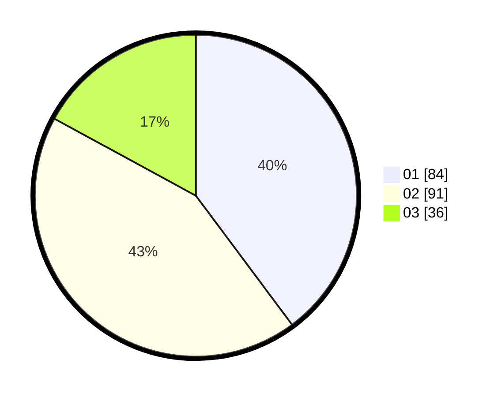

# Hasil

Hasil perolehan suara paslon dapat dilihat pada file paslon-01.txt, paslon-02.txt, dan paslon-03.txt.

Jika tidak ada, artinya data tersebut belum ada pada SIREKAP.

## Perolehan Suara

 * Paslon 01: **84**.
 * Paslon 02: **91**.
 * Paslon 03: **36**.

## Foto C Plano

https://sirekap-obj-formc.kpu.go.id/14fb/pemilu/ppwp/31/74/09/10/02/3174091002011-20240214-192719--85bc61ec-b006-4654-a017-e41bbb374450.jpg

https://sirekap-obj-formc.kpu.go.id/14fb/pemilu/ppwp/31/74/09/10/02/3174091002011-20240214-193702--fccce89c-5bd3-4ba2-9fe2-603683d43c14.jpg

https://sirekap-obj-formc.kpu.go.id/14fb/pemilu/ppwp/31/74/09/10/02/3174091002011-20240214-191239--fc4f1d56-197d-44cc-98f5-fd0a838b3f21.jpg

## DATA PEMILIH TETAP

Jumlah pemilih dalam DPT: **253**.
 * L: **139**.
 * P: **114**.

## DATA PENGGUNA HAK PILIH

Jumlah pengguna hak pilih dalam DPT: **210**.
 * L: **101**.
 * P: **109**.

Jumlah pengguna hak pilih dalam DPTb: **3**.
 * L: **1**.
 * P: **2**.

Jumlah pengguna hak pilih dalam DPK: **2**.
 * L: **1**.
 * P: **1**.

Jumlah pengguna hak pilih: **215**.
 * L: **103**.
 * P: **112**.

## JUMLAH SUARA SAH DAN TIDAK SAH

JUMLAH SELURUH SUARA SAH: **211**.

JUMLAH SUARA TIDAK SAH: **4**.

JUMLAH SELURUH SUARA SAH DAN SUARA TIDAK SAH: **215**.
