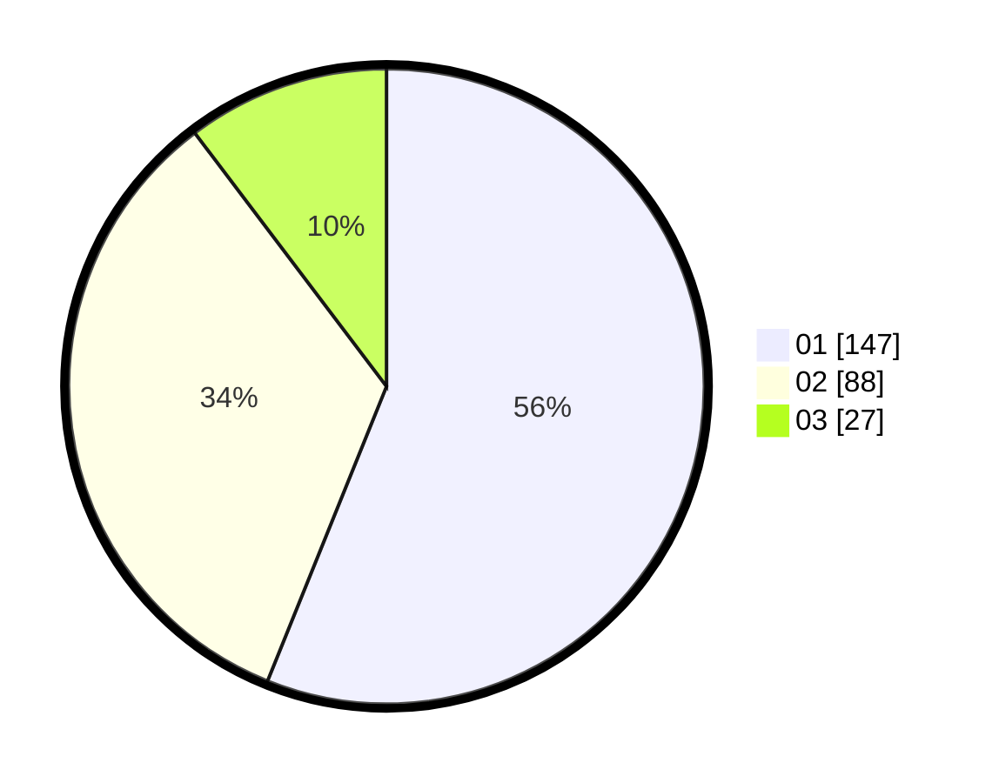

# Hasil

Hasil perolehan suara paslon dapat dilihat pada file paslon-01.txt, paslon-02.txt, dan paslon-03.txt.

Jika tidak ada, artinya data tersebut belum ada pada SIREKAP.

## Perolehan Suara

 * Paslon 01: **147**.
 * Paslon 02: **88**.
 * Paslon 03: **27**.

## Foto C Plano

https://sirekap-obj-formc.kpu.go.id/4473/pemilu/ppwp/31/74/09/10/02/3174091002017-20240215-193233--67ca718c-cc9f-44bf-84a5-bfbddbe85698.jpg

https://sirekap-obj-formc.kpu.go.id/4473/pemilu/ppwp/31/74/09/10/02/3174091002017-20240215-193327--67385a9a-593c-4ee6-ad47-875b200af385.jpg

https://sirekap-obj-formc.kpu.go.id/4473/pemilu/ppwp/31/74/09/10/02/3174091002017-20240215-193412--b4202978-4eb2-47c1-b10c-9627c00dbf84.jpg

## DATA PEMILIH TETAP

Jumlah pemilih dalam DPT: **297**.
 * L: **144**.
 * P: **153**.

## DATA PENGGUNA HAK PILIH

Jumlah pengguna hak pilih dalam DPT: **256**.
 * L: **119**.
 * P: **137**.

Jumlah pengguna hak pilih dalam DPTb: **2**.
 * L: **1**.
 * P: **1**.

Jumlah pengguna hak pilih dalam DPK: **6**.
 * L: **2**.
 * P: **4**.

Jumlah pengguna hak pilih: **264**.
 * L: **122**.
 * P: **142**.

## JUMLAH SUARA SAH DAN TIDAK SAH

JUMLAH SELURUH SUARA SAH: **262**.

JUMLAH SUARA TIDAK SAH: **2**.

JUMLAH SELURUH SUARA SAH DAN SUARA TIDAK SAH: **264**.
