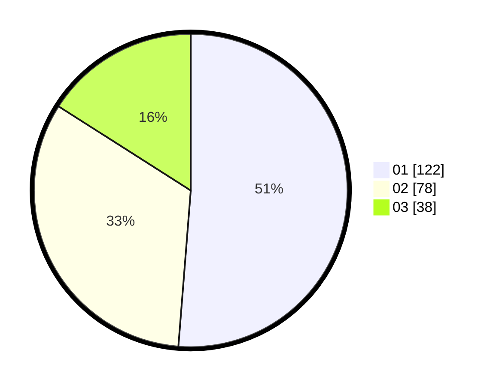

# Hasil

Hasil perolehan suara paslon dapat dilihat pada file paslon-01.txt, paslon-02.txt, dan paslon-03.txt.

Jika tidak ada, artinya data tersebut belum ada pada SIREKAP.

## Perolehan Suara

 * Paslon 01: **122**.
 * Paslon 02: **78**.
 * Paslon 03: **38**.

## Foto C Plano

https://sirekap-obj-formc.kpu.go.id/032a/pemilu/ppwp/31/74/09/10/02/3174091002020-20240215-033134--d051cb92-421d-4889-a4ce-d9b37bedc043.jpg

https://sirekap-obj-formc.kpu.go.id/032a/pemilu/ppwp/31/74/09/10/02/3174091002020-20240215-033201--f0862ec1-e28d-406a-a0f1-ea5ff7ff2391.jpg

https://sirekap-obj-formc.kpu.go.id/032a/pemilu/ppwp/31/74/09/10/02/3174091002020-20240215-033217--ece2dca8-8829-4693-9fe6-84e0a481917e.jpg

## DATA PEMILIH TETAP

Jumlah pemilih dalam DPT: **295**.
 * L: **145**.
 * P: **150**.

## DATA PENGGUNA HAK PILIH

Jumlah pengguna hak pilih dalam DPT: **241**.
 * L: **111**.
 * P: **130**.

Jumlah pengguna hak pilih dalam DPTb: **1**.
 * L: **1**.
 * P: **0**.

Jumlah pengguna hak pilih dalam DPK: **2**.
 * L: **1**.
 * P: **1**.

Jumlah pengguna hak pilih: **244**.
 * L: **113**.
 * P: **131**.

## JUMLAH SUARA SAH DAN TIDAK SAH

JUMLAH SELURUH SUARA SAH: **238**.

JUMLAH SUARA TIDAK SAH: **6**.

JUMLAH SELURUH SUARA SAH DAN SUARA TIDAK SAH: **244**.
