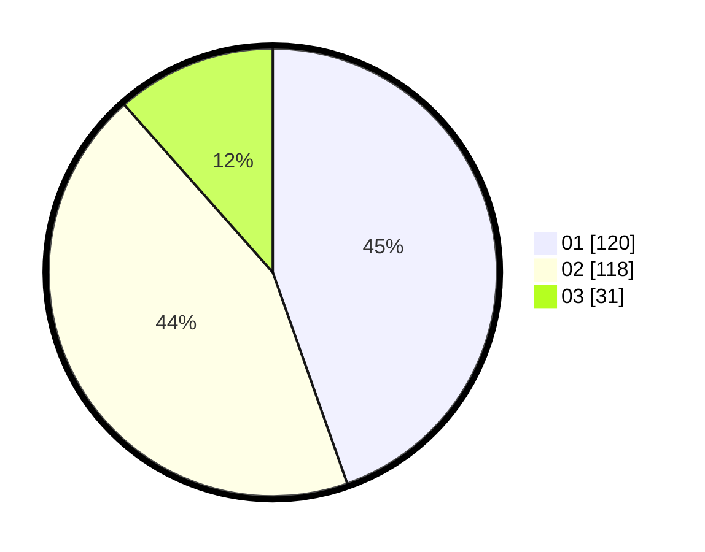

# Hasil

Hasil perolehan suara paslon dapat dilihat pada file paslon-01.txt, paslon-02.txt, dan paslon-03.txt.

Jika tidak ada, artinya data tersebut belum ada pada SIREKAP.

## Perolehan Suara

 * Paslon 01: **120**.
 * Paslon 02: **118**.
 * Paslon 03: **31**.

## Foto C Plano

https://sirekap-obj-formc.kpu.go.id/5948/pemilu/ppwp/31/74/09/10/02/3174091002021-20240215-204730--0be2537c-872d-449e-a54e-56f5ddb4b75e.jpg

https://sirekap-obj-formc.kpu.go.id/5948/pemilu/ppwp/31/74/09/10/02/3174091002021-20240216-180028--74740f9e-d077-42ac-8bdb-2406e7c76128.jpg

https://sirekap-obj-formc.kpu.go.id/5948/pemilu/ppwp/31/74/09/10/02/3174091002021-20240216-083520--3d1531ab-8533-42a1-a550-ddc29e9f637f.jpg

## DATA PEMILIH TETAP

Jumlah pemilih dalam DPT: **296**.
 * L: **146**.
 * P: **150**.

## DATA PENGGUNA HAK PILIH

Jumlah pengguna hak pilih dalam DPT: **268**.
 * L: **127**.
 * P: **141**.

Jumlah pengguna hak pilih dalam DPTb: **6**.
 * L: **3**.
 * P: **3**.

Jumlah pengguna hak pilih dalam DPK: **0**.
 * L: **0**.
 * P: **0**.

Jumlah pengguna hak pilih: **274**.
 * L: **130**.
 * P: **144**.

## JUMLAH SUARA SAH DAN TIDAK SAH

JUMLAH SELURUH SUARA SAH: **269**.

JUMLAH SUARA TIDAK SAH: **5**.

JUMLAH SELURUH SUARA SAH DAN SUARA TIDAK SAH: **274**.
