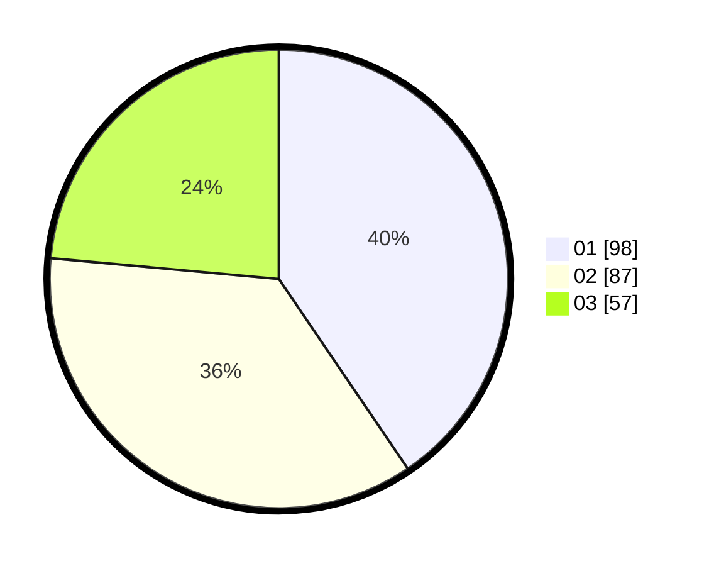

# Hasil

Hasil perolehan suara paslon dapat dilihat pada file paslon-01.txt, paslon-02.txt, dan paslon-03.txt.

Jika tidak ada, artinya data tersebut belum ada pada SIREKAP.

## Perolehan Suara

 * Paslon 01: **98**.
 * Paslon 02: **87**.
 * Paslon 03: **57**.

## Foto C Plano

https://sirekap-obj-formc.kpu.go.id/64e0/pemilu/ppwp/31/74/09/10/02/3174091002025-20240216-131450--424231b2-bfbe-4b88-aa37-51eec21a8482.jpg

https://sirekap-obj-formc.kpu.go.id/64e0/pemilu/ppwp/31/74/09/10/02/3174091002025-20240216-131452--7dde2596-325c-41b6-bc05-c4d3028548f4.jpg

https://sirekap-obj-formc.kpu.go.id/64e0/pemilu/ppwp/31/74/09/10/02/3174091002025-20240216-131451--9e3d3bb9-4d3c-43c1-916a-20e641fcb2e2.jpg

## DATA PEMILIH TETAP

Jumlah pemilih dalam DPT: **284**.
 * L: **140**.
 * P: **144**.

## DATA PENGGUNA HAK PILIH

Jumlah pengguna hak pilih dalam DPT: **236**.
 * L: **114**.
 * P: **122**.

Jumlah pengguna hak pilih dalam DPTb: **10**.
 * L: **5**.
 * P: **5**.

Jumlah pengguna hak pilih dalam DPK: **0**.
 * L: **0**.
 * P: **0**.

Jumlah pengguna hak pilih: **246**.
 * L: **119**.
 * P: **127**.

## JUMLAH SUARA SAH DAN TIDAK SAH

JUMLAH SELURUH SUARA SAH: **242**.

JUMLAH SUARA TIDAK SAH: **4**.

JUMLAH SELURUH SUARA SAH DAN SUARA TIDAK SAH: **246**.
