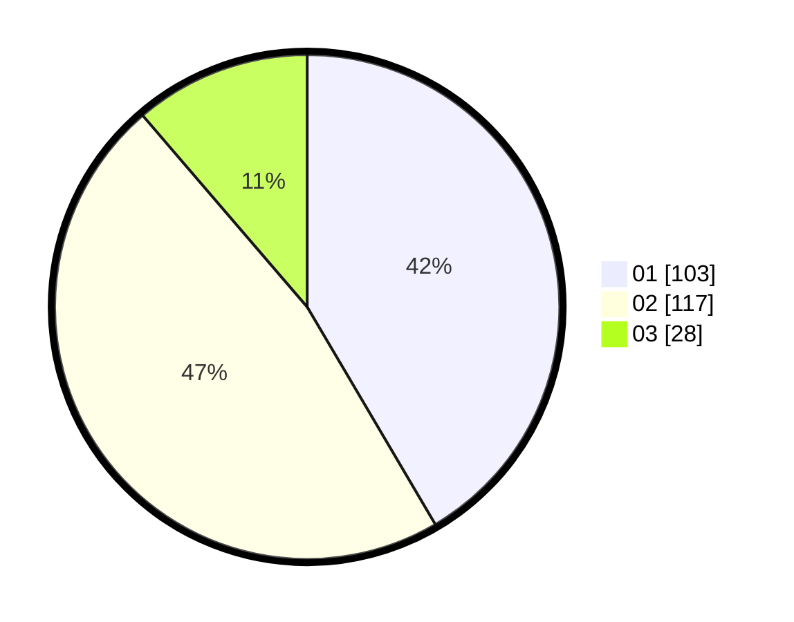

# Hasil

Hasil perolehan suara paslon dapat dilihat pada file paslon-01.txt, paslon-02.txt, dan paslon-03.txt.

Jika tidak ada, artinya data tersebut belum ada pada SIREKAP.

## Perolehan Suara

 * Paslon 01: **103**.
 * Paslon 02: **117**.
 * Paslon 03: **28**.

## Foto C Plano

https://sirekap-obj-formc.kpu.go.id/66b7/pemilu/ppwp/31/74/09/10/02/3174091002031-20240214-192640--5ea6d4bd-309e-4d28-ae4c-296b17e699c6.jpg

https://sirekap-obj-formc.kpu.go.id/66b7/pemilu/ppwp/31/74/09/10/02/3174091002031-20240214-191430--964bd643-dce9-4969-934f-c9c6a7f621ab.jpg

https://sirekap-obj-formc.kpu.go.id/66b7/pemilu/ppwp/31/74/09/10/02/3174091002031-20240215-210526--a7854d36-d03b-4a7d-9ef3-f9069df5cc0c.jpg
