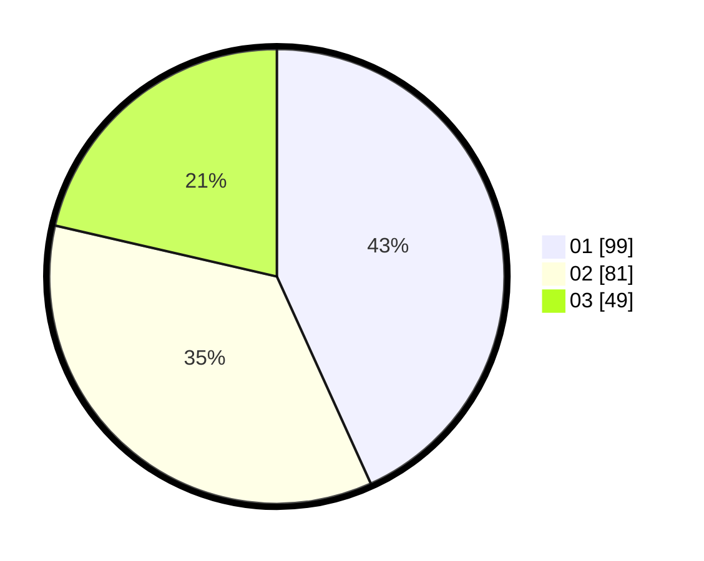

# Hasil

Hasil perolehan suara paslon dapat dilihat pada file paslon-01.txt, paslon-02.txt, dan paslon-03.txt.

Jika tidak ada, artinya data tersebut belum ada pada SIREKAP.

## Perolehan Suara

 * Paslon 01: **99**.
 * Paslon 02: **81**.
 * Paslon 03: **49**.

## Foto C Plano

https://sirekap-obj-formc.kpu.go.id/c7d2/pemilu/ppwp/31/74/09/10/02/3174091002033-20240215-230044--07a21cc8-380e-4aca-90e7-de78e8764da9.jpg

https://sirekap-obj-formc.kpu.go.id/c7d2/pemilu/ppwp/31/74/09/10/02/3174091002033-20240215-231000--74377adb-adff-4e49-9000-36f3eec7048b.jpg

https://sirekap-obj-formc.kpu.go.id/c7d2/pemilu/ppwp/31/74/09/10/02/3174091002033-20240215-231212--3dd0cb2b-0b4d-4984-b57e-124d34dc0489.jpg

## DATA PEMILIH TETAP

Jumlah pemilih dalam DPT: **296**.
 * L: **155**.
 * P: **141**.

## DATA PENGGUNA HAK PILIH

Jumlah pengguna hak pilih dalam DPT: **226**.
 * L: **120**.
 * P: **106**.

Jumlah pengguna hak pilih dalam DPTb: **1**.
 * L: **0**.
 * P: **1**.

Jumlah pengguna hak pilih dalam DPK: **3**.
 * L: **1**.
 * P: **2**.

Jumlah pengguna hak pilih: **230**.
 * L: **121**.
 * P: **109**.

## JUMLAH SUARA SAH DAN TIDAK SAH

JUMLAH SELURUH SUARA SAH: **229**.

JUMLAH SUARA TIDAK SAH: **1**.

JUMLAH SELURUH SUARA SAH DAN SUARA TIDAK SAH: **230**.
