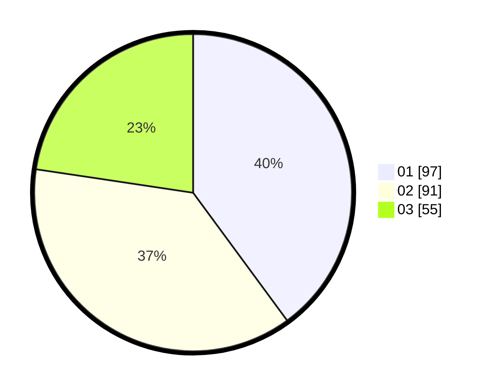

# Hasil

Hasil perolehan suara paslon dapat dilihat pada file paslon-01.txt, paslon-02.txt, dan paslon-03.txt.

Jika tidak ada, artinya data tersebut belum ada pada SIREKAP.

## Perolehan Suara

 * Paslon 01: **97**.
 * Paslon 02: **91**.
 * Paslon 03: **55**.

## Foto C Plano

https://sirekap-obj-formc.kpu.go.id/f545/pemilu/ppwp/31/74/09/10/02/3174091002034-20240214-202611--bd8efab2-add3-47e2-87cc-2e8c5cd7adc3.jpg

https://sirekap-obj-formc.kpu.go.id/f545/pemilu/ppwp/31/74/09/10/02/3174091002034-20240214-202658--9a45e7ca-ce76-4831-83d8-2999ff6ae2ef.jpg

https://sirekap-obj-formc.kpu.go.id/f545/pemilu/ppwp/31/74/09/10/02/3174091002034-20240214-202741--940b208f-c65b-42b9-9297-6bc33d6267ab.jpg

## DATA PEMILIH TETAP

Jumlah pemilih dalam DPT: **291**.
 * L: **133**.
 * P: **158**.

## DATA PENGGUNA HAK PILIH

Jumlah pengguna hak pilih dalam DPT: **241**.
 * L: **101**.
 * P: **140**.

Jumlah pengguna hak pilih dalam DPTb: **2**.
 * L: **1**.
 * P: **1**.

Jumlah pengguna hak pilih dalam DPK: **2**.
 * L: **1**.
 * P: **1**.

Jumlah pengguna hak pilih: **245**.
 * L: **103**.
 * P: **142**.

## JUMLAH SUARA SAH DAN TIDAK SAH

JUMLAH SELURUH SUARA SAH: **243**.

JUMLAH SUARA TIDAK SAH: **2**.

JUMLAH SELURUH SUARA SAH DAN SUARA TIDAK SAH: **245**.
