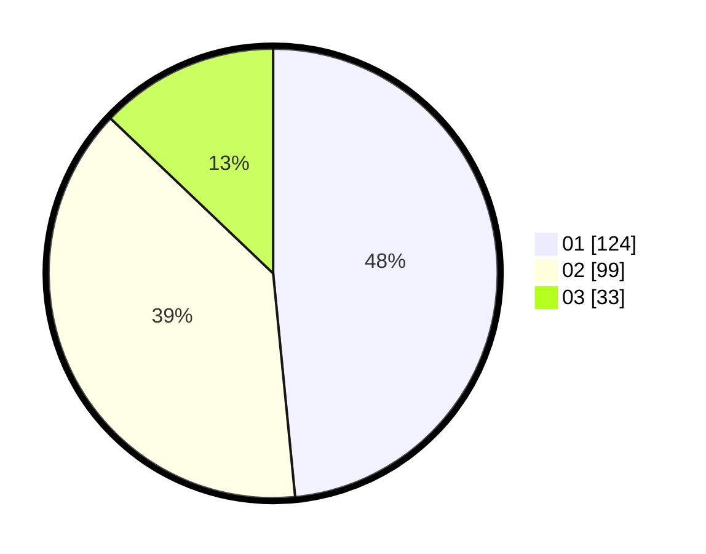

# Hasil

Hasil perolehan suara paslon dapat dilihat pada file paslon-01.txt, paslon-02.txt, dan paslon-03.txt.

Jika tidak ada, artinya data tersebut belum ada pada SIREKAP.

## Perolehan Suara

 * Paslon 01: **124**.
 * Paslon 02: **99**.
 * Paslon 03: **33**.

## Foto C Plano

https://sirekap-obj-formc.kpu.go.id/c35d/pemilu/ppwp/31/74/09/10/02/3174091002038-20240214-204715--a31ce135-c900-4161-b1d6-75ffa2efea60.jpg

https://sirekap-obj-formc.kpu.go.id/c35d/pemilu/ppwp/31/74/09/10/02/3174091002038-20240214-233850--84618302-6ba1-49f8-a458-8afc3d4db2da.jpg

https://sirekap-obj-formc.kpu.go.id/c35d/pemilu/ppwp/31/74/09/10/02/3174091002038-20240214-234039--c575da56-c9b5-4a2f-adf2-f6ffffda537f.jpg

## DATA PEMILIH TETAP

Jumlah pemilih dalam DPT: **232**.
 * L: **133**.
 * P: **157**.

## DATA PENGGUNA HAK PILIH

Jumlah pengguna hak pilih dalam DPT: **251**.
 * L: **112**.
 * P: **156**.

Jumlah pengguna hak pilih dalam DPTb: **8**.
 * L: **2**.
 * P: **6**.

Jumlah pengguna hak pilih dalam DPK: **2**.
 * L: **7**.
 * P: **0**.

Jumlah pengguna hak pilih: **250**.
 * L: **178**.
 * P: **142**.

## JUMLAH SUARA SAH DAN TIDAK SAH

JUMLAH SELURUH SUARA SAH: **256**.

JUMLAH SUARA TIDAK SAH: **4**.

JUMLAH SELURUH SUARA SAH DAN SUARA TIDAK SAH: **260**.
