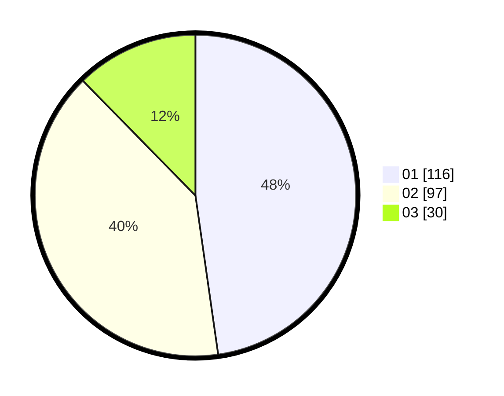

# Hasil

Hasil perolehan suara paslon dapat dilihat pada file paslon-01.txt, paslon-02.txt, dan paslon-03.txt.

Jika tidak ada, artinya data tersebut belum ada pada SIREKAP.

## Perolehan Suara

 * Paslon 01: **116**.
 * Paslon 02: **97**.
 * Paslon 03: **30**.

## Foto C Plano

https://sirekap-obj-formc.kpu.go.id/7d85/pemilu/ppwp/31/74/09/10/02/3174091002054-20240214-185206--851536e4-fc4c-4366-ad4e-4571cd6b0f9f.jpg

https://sirekap-obj-formc.kpu.go.id/7d85/pemilu/ppwp/31/74/09/10/02/3174091002054-20240215-015902--99b01f72-60e4-4701-baa9-8a2e55555fda.jpg

https://sirekap-obj-formc.kpu.go.id/7d85/pemilu/ppwp/31/74/09/10/02/3174091002054-20240214-185219--5a9bd60f-688c-44e5-96db-e581fb4aab32.jpg

## DATA PEMILIH TETAP

Jumlah pemilih dalam DPT: **290**.
 * L: **143**.
 * P: **147**.

## DATA PENGGUNA HAK PILIH

Jumlah pengguna hak pilih dalam DPT: **246**.
 * L: **116**.
 * P: **130**.

Jumlah pengguna hak pilih dalam DPTb: **1**.
 * L: **0**.
 * P: **1**.

Jumlah pengguna hak pilih dalam DPK: **0**.
 * L: **0**.
 * P: **0**.

Jumlah pengguna hak pilih: **247**.
 * L: **116**.
 * P: **131**.

## JUMLAH SUARA SAH DAN TIDAK SAH

JUMLAH SELURUH SUARA SAH: **243**.

JUMLAH SUARA TIDAK SAH: **4**.

JUMLAH SELURUH SUARA SAH DAN SUARA TIDAK SAH: **247**.
