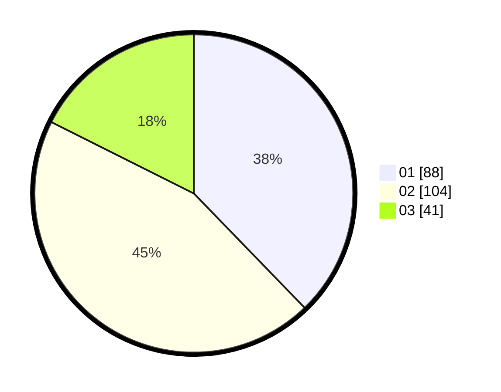

# Hasil

Hasil perolehan suara paslon dapat dilihat pada file paslon-01.txt, paslon-02.txt, dan paslon-03.txt.

Jika tidak ada, artinya data tersebut belum ada pada SIREKAP.

## Perolehan Suara

 * Paslon 01: **88**.
 * Paslon 02: **104**.
 * Paslon 03: **41**.

## Foto C Plano

https://sirekap-obj-formc.kpu.go.id/f8a3/pemilu/ppwp/31/74/09/10/02/3174091002055-20240214-200104--ed95ab4c-b2e1-4df6-90f6-f40c9390f906.jpg

https://sirekap-obj-formc.kpu.go.id/f8a3/pemilu/ppwp/31/74/09/10/02/3174091002055-20240214-200212--80133a4e-6cd2-4ea2-bd2c-f243074748b7.jpg

https://sirekap-obj-formc.kpu.go.id/f8a3/pemilu/ppwp/31/74/09/10/02/3174091002055-20240214-195936--077ce480-eb8c-4546-b32c-34ba9b6f545d.jpg
