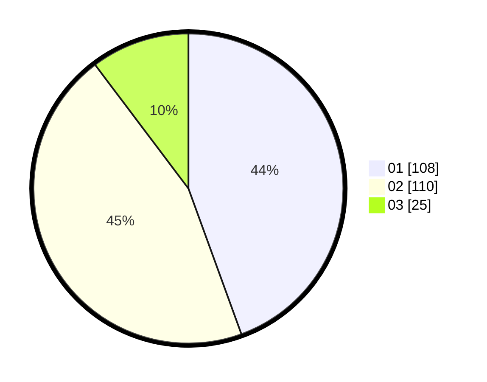

# Hasil

Hasil perolehan suara paslon dapat dilihat pada file paslon-01.txt, paslon-02.txt, dan paslon-03.txt.

Jika tidak ada, artinya data tersebut belum ada pada SIREKAP.

## Perolehan Suara

 * Paslon 01: **108**.
 * Paslon 02: **110**.
 * Paslon 03: **25**.

## Foto C Plano

https://sirekap-obj-formc.kpu.go.id/abaf/pemilu/ppwp/31/74/09/10/02/3174091002056-20240214-160111--b35f252e-e8a1-4fa9-b6d3-2c12003511b7.jpg

https://sirekap-obj-formc.kpu.go.id/abaf/pemilu/ppwp/31/74/09/10/02/3174091002056-20240214-155417--4a4c05df-9c46-4a22-a288-a1fb2ec5dfdb.jpg

https://sirekap-obj-formc.kpu.go.id/abaf/pemilu/ppwp/31/74/09/10/02/3174091002056-20240214-155216--185d602b-4de1-47f7-926d-46f0b3c75ca2.jpg

## DATA PEMILIH TETAP

Jumlah pemilih dalam DPT: **288**.
 * L: **132**.
 * P: **156**.

## DATA PENGGUNA HAK PILIH

Jumlah pengguna hak pilih dalam DPT: **242**.
 * L: **106**.
 * P: **136**.

Jumlah pengguna hak pilih dalam DPTb: **1**.
 * L: **1**.
 * P: **0**.

Jumlah pengguna hak pilih dalam DPK: **1**.
 * L: **0**.
 * P: **1**.

Jumlah pengguna hak pilih: **244**.
 * L: **107**.
 * P: **137**.

## JUMLAH SUARA SAH DAN TIDAK SAH

JUMLAH SELURUH SUARA SAH: **243**.

JUMLAH SUARA TIDAK SAH: **1**.

JUMLAH SELURUH SUARA SAH DAN SUARA TIDAK SAH: **244**.
