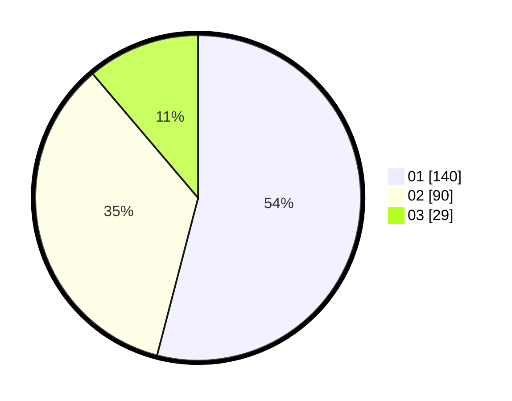

# Hasil

Hasil perolehan suara paslon dapat dilihat pada file paslon-01.txt, paslon-02.txt, dan paslon-03.txt.

Jika tidak ada, artinya data tersebut belum ada pada SIREKAP.

## Perolehan Suara

 * Paslon 01: **140**.
 * Paslon 02: **90**.
 * Paslon 03: **29**.

## Foto C Plano

https://sirekap-obj-formc.kpu.go.id/706f/pemilu/ppwp/31/74/09/10/02/3174091002061-20240214-185537--c1adb419-4ce3-4e2f-8784-c999e1960544.jpg

https://sirekap-obj-formc.kpu.go.id/706f/pemilu/ppwp/31/74/09/10/02/3174091002061-20240214-185559--d655e4a3-a2f4-4fb4-b225-27e8de67e356.jpg

https://sirekap-obj-formc.kpu.go.id/706f/pemilu/ppwp/31/74/09/10/02/3174091002061-20240214-185548--d3724dfc-3388-434a-8cc5-fb575901ecd0.jpg

## DATA PEMILIH TETAP

Jumlah pemilih dalam DPT: **294**.
 * L: **143**.
 * P: **151**.

## DATA PENGGUNA HAK PILIH

Jumlah pengguna hak pilih dalam DPT: **258**.
 * L: **125**.
 * P: **133**.

Jumlah pengguna hak pilih dalam DPTb: **4**.
 * L: **1**.
 * P: **3**.

Jumlah pengguna hak pilih dalam DPK: **0**.
 * L: **0**.
 * P: **0**.

Jumlah pengguna hak pilih: **262**.
 * L: **126**.
 * P: **136**.

## JUMLAH SUARA SAH DAN TIDAK SAH

JUMLAH SELURUH SUARA SAH: **259**.

JUMLAH SUARA TIDAK SAH: **3**.

JUMLAH SELURUH SUARA SAH DAN SUARA TIDAK SAH: **262**.
