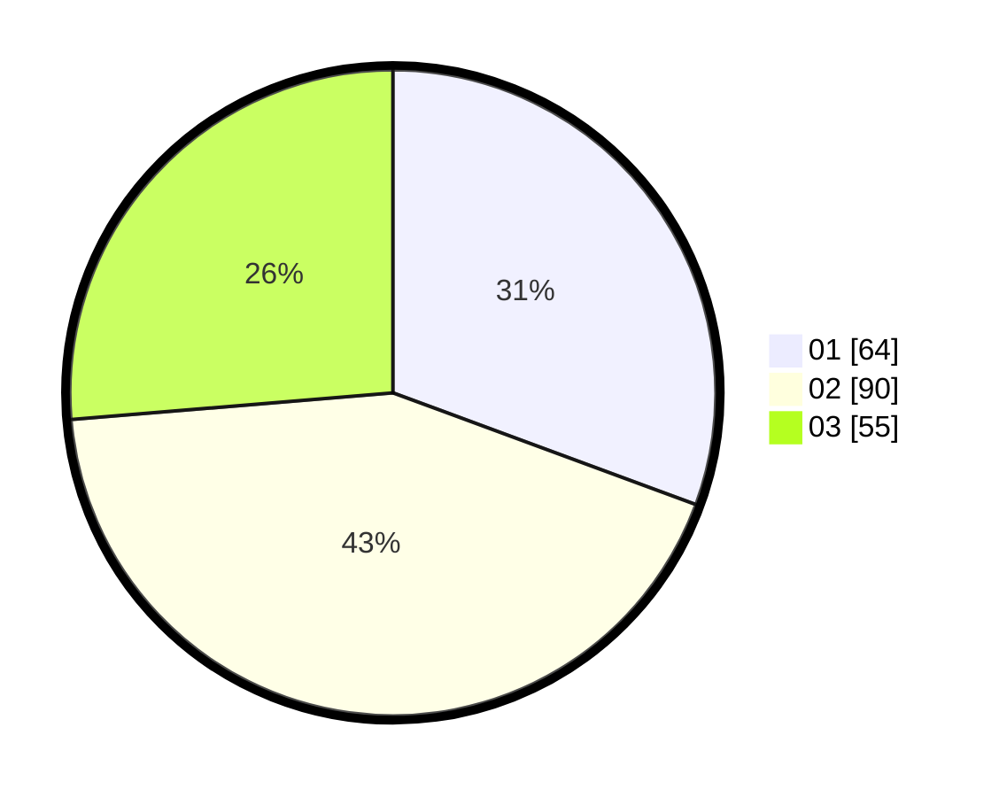

# Hasil

Hasil perolehan suara paslon dapat dilihat pada file paslon-01.txt, paslon-02.txt, dan paslon-03.txt.

Jika tidak ada, artinya data tersebut belum ada pada SIREKAP.

## Perolehan Suara

 * Paslon 01: **64**.
 * Paslon 02: **90**.
 * Paslon 03: **55**.

## Foto C Plano

https://sirekap-obj-formc.kpu.go.id/355a/pemilu/ppwp/31/74/09/10/02/3174091002065-20240214-191817--f8ff8424-288d-4d73-b097-351d7430383c.jpg

https://sirekap-obj-formc.kpu.go.id/355a/pemilu/ppwp/31/74/09/10/02/3174091002065-20240214-191831--c1522d77-ca86-46b5-a8db-fc7308aa79ca.jpg

https://sirekap-obj-formc.kpu.go.id/355a/pemilu/ppwp/31/74/09/10/02/3174091002065-20240214-191838--288dc170-d5c6-49f5-9eb3-5744df711cc4.jpg

## DATA PEMILIH TETAP

Jumlah pemilih dalam DPT: **253**.
 * L: **123**.
 * P: **130**.

## DATA PENGGUNA HAK PILIH

Jumlah pengguna hak pilih dalam DPT: **208**.
 * L: **97**.
 * P: **111**.

Jumlah pengguna hak pilih dalam DPTb: **7**.
 * L: **3**.
 * P: **4**.

Jumlah pengguna hak pilih dalam DPK: **1**.
 * L: **0**.
 * P: **1**.

Jumlah pengguna hak pilih: **216**.
 * L: **100**.
 * P: **116**.

## JUMLAH SUARA SAH DAN TIDAK SAH

JUMLAH SELURUH SUARA SAH: **209**.

JUMLAH SUARA TIDAK SAH: **7**.

JUMLAH SELURUH SUARA SAH DAN SUARA TIDAK SAH: **216**.
