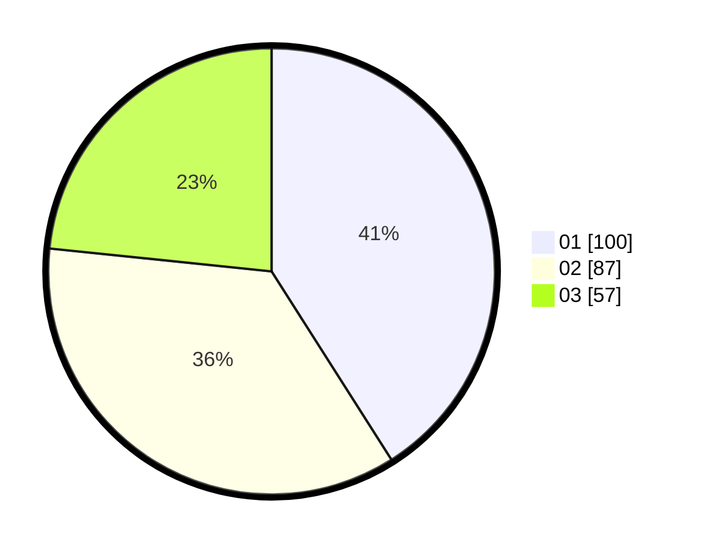

# Hasil

Hasil perolehan suara paslon dapat dilihat pada file paslon-01.txt, paslon-02.txt, dan paslon-03.txt.

Jika tidak ada, artinya data tersebut belum ada pada SIREKAP.

## Perolehan Suara

 * Paslon 01: **100**.
 * Paslon 02: **87**.
 * Paslon 03: **57**.

## Foto C Plano

https://sirekap-obj-formc.kpu.go.id/5295/pemilu/ppwp/31/74/09/10/02/3174091002066-20240214-220811--7aff4f70-a6c3-4199-a861-1b1a36cdb239.jpg

https://sirekap-obj-formc.kpu.go.id/5295/pemilu/ppwp/31/74/09/10/02/3174091002066-20240214-221558--63fea364-7cbc-4ced-a4b1-3747e573d913.jpg

https://sirekap-obj-formc.kpu.go.id/5295/pemilu/ppwp/31/74/09/10/02/3174091002066-20240214-222224--f3de18b8-18c5-4b89-b2de-4947eb8dd2f2.jpg
