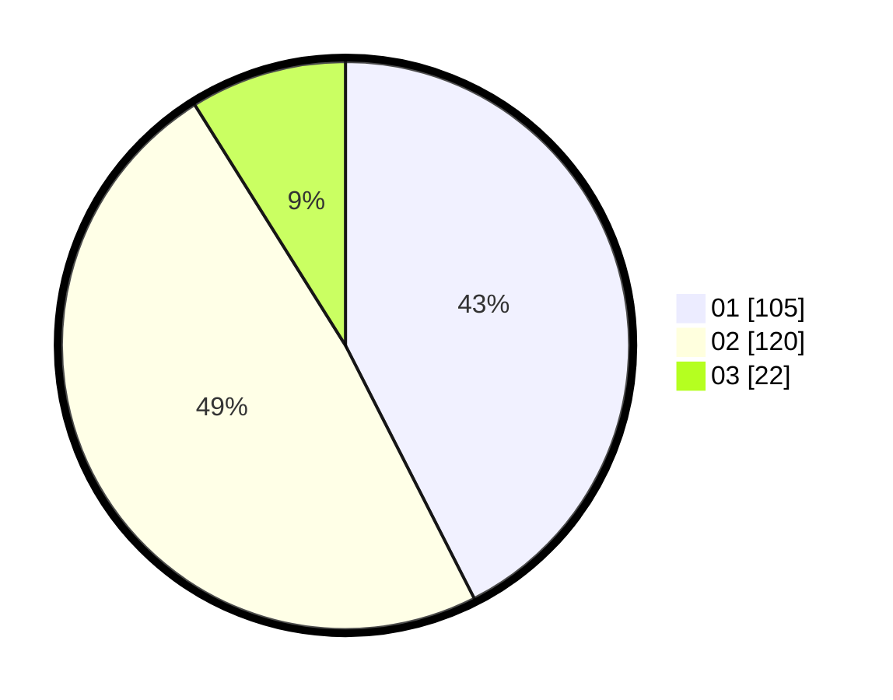

# Hasil

Hasil perolehan suara paslon dapat dilihat pada file paslon-01.txt, paslon-02.txt, dan paslon-03.txt.

Jika tidak ada, artinya data tersebut belum ada pada SIREKAP.

## Perolehan Suara

 * Paslon 01: **105**.
 * Paslon 02: **120**.
 * Paslon 03: **22**.

## Foto C Plano

https://sirekap-obj-formc.kpu.go.id/958e/pemilu/ppwp/31/74/09/10/02/3174091002071-20240214-193106--97f0466e-f34d-4f67-938e-66f9a2c4f6d1.jpg

https://sirekap-obj-formc.kpu.go.id/958e/pemilu/ppwp/31/74/09/10/02/3174091002071-20240214-193129--eecd71e0-928f-4466-80a7-16cca556f5fb.jpg

https://sirekap-obj-formc.kpu.go.id/958e/pemilu/ppwp/31/74/09/10/02/3174091002071-20240214-193151--d8600306-3aed-4481-843c-2ea31967ddbf.jpg

## DATA PEMILIH TETAP

Jumlah pemilih dalam DPT: **264**.
 * L: **128**.
 * P: **136**.

## DATA PENGGUNA HAK PILIH

Jumlah pengguna hak pilih dalam DPT: **240**.
 * L: **114**.
 * P: **126**.

Jumlah pengguna hak pilih dalam DPTb: **2**.
 * L: **1**.
 * P: **1**.

Jumlah pengguna hak pilih dalam DPK: **6**.
 * L: **4**.
 * P: **2**.

Jumlah pengguna hak pilih: **248**.
 * L: **119**.
 * P: **129**.

## JUMLAH SUARA SAH DAN TIDAK SAH

JUMLAH SELURUH SUARA SAH: **247**.

JUMLAH SUARA TIDAK SAH: **1**.

JUMLAH SELURUH SUARA SAH DAN SUARA TIDAK SAH: **248**.
