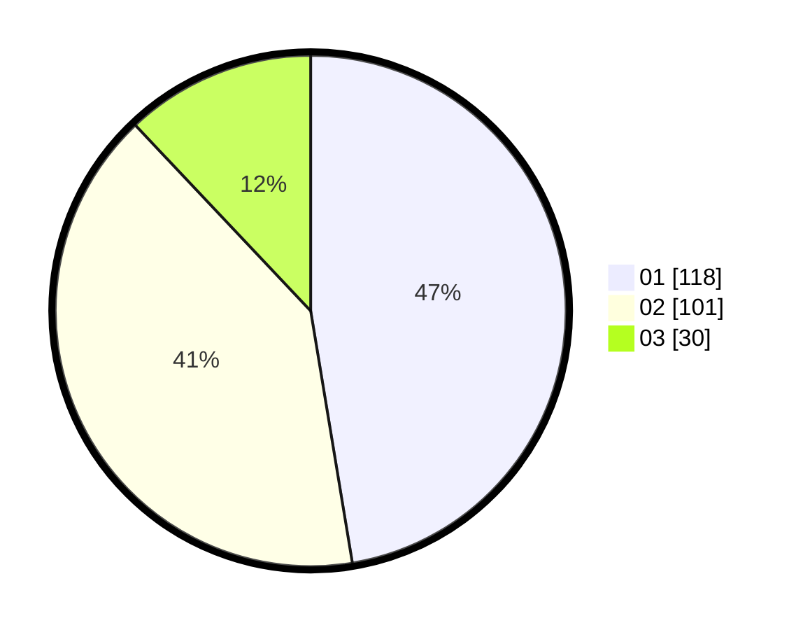

# Hasil

Hasil perolehan suara paslon dapat dilihat pada file paslon-01.txt, paslon-02.txt, dan paslon-03.txt.

Jika tidak ada, artinya data tersebut belum ada pada SIREKAP.

## Perolehan Suara

 * Paslon 01: **118**.
 * Paslon 02: **101**.
 * Paslon 03: **30**.

## Foto C Plano

https://sirekap-obj-formc.kpu.go.id/4677/pemilu/ppwp/31/74/09/10/02/3174091002077-20240214-215325--7d492102-c2c2-4ddf-ae73-5f19310286db.jpg

https://sirekap-obj-formc.kpu.go.id/4677/pemilu/ppwp/31/74/09/10/02/3174091002077-20240214-215406--4712dbd5-3689-4a38-ad72-82061932d66d.jpg

https://sirekap-obj-formc.kpu.go.id/4677/pemilu/ppwp/31/74/09/10/02/3174091002077-20240214-215458--079d17b3-ad48-4d65-9251-1625e63a9ca2.jpg

## DATA PEMILIH TETAP

Jumlah pemilih dalam DPT: **289**.
 * L: **144**.
 * P: **145**.

## DATA PENGGUNA HAK PILIH

Jumlah pengguna hak pilih dalam DPT: **244**.
 * L: **118**.
 * P: **126**.

Jumlah pengguna hak pilih dalam DPTb: **1**.
 * L: **0**.
 * P: **1**.

Jumlah pengguna hak pilih dalam DPK: **4**.
 * L: **3**.
 * P: **1**.

Jumlah pengguna hak pilih: **249**.
 * L: **121**.
 * P: **128**.

## JUMLAH SUARA SAH DAN TIDAK SAH

JUMLAH SELURUH SUARA SAH: **249**.

JUMLAH SUARA TIDAK SAH: **0**.

JUMLAH SELURUH SUARA SAH DAN SUARA TIDAK SAH: **249**.
