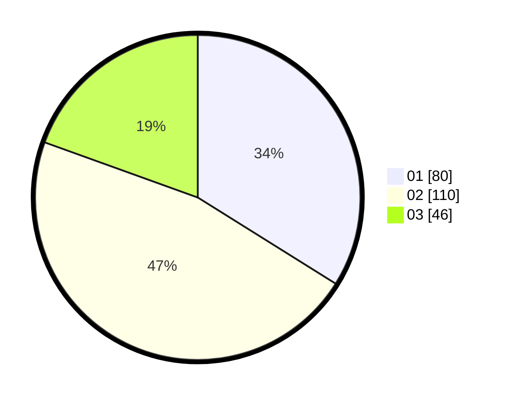

# Hasil

Hasil perolehan suara paslon dapat dilihat pada file paslon-01.txt, paslon-02.txt, dan paslon-03.txt.

Jika tidak ada, artinya data tersebut belum ada pada SIREKAP.

## Perolehan Suara

 * Paslon 01: **80**.
 * Paslon 02: **110**.
 * Paslon 03: **46**.

## Foto C Plano

https://sirekap-obj-formc.kpu.go.id/a21d/pemilu/ppwp/31/74/09/10/02/3174091002079-20240215-010230--49adc542-adee-46b9-bfe7-abf5119f49a7.jpg

https://sirekap-obj-formc.kpu.go.id/a21d/pemilu/ppwp/31/74/09/10/02/3174091002079-20240215-010937--9a0b0dbc-bbe8-459c-a1af-6ff912e02642.jpg

https://sirekap-obj-formc.kpu.go.id/a21d/pemilu/ppwp/31/74/09/10/02/3174091002079-20240215-011109--45e43eda-4bf4-4003-ba94-0546b52b5c91.jpg

## DATA PEMILIH TETAP

Jumlah pemilih dalam DPT: **292**.
 * L: **137**.
 * P: **155**.

## DATA PENGGUNA HAK PILIH

Jumlah pengguna hak pilih dalam DPT: **242**.
 * L: **111**.
 * P: **131**.

Jumlah pengguna hak pilih dalam DPTb: **2**.
 * L: **1**.
 * P: **1**.

Jumlah pengguna hak pilih dalam DPK: **1**.
 * L: **0**.
 * P: **1**.

Jumlah pengguna hak pilih: **245**.
 * L: **112**.
 * P: **133**.

## JUMLAH SUARA SAH DAN TIDAK SAH

JUMLAH SELURUH SUARA SAH: **236**.

JUMLAH SUARA TIDAK SAH: **9**.

JUMLAH SELURUH SUARA SAH DAN SUARA TIDAK SAH: **245**.
