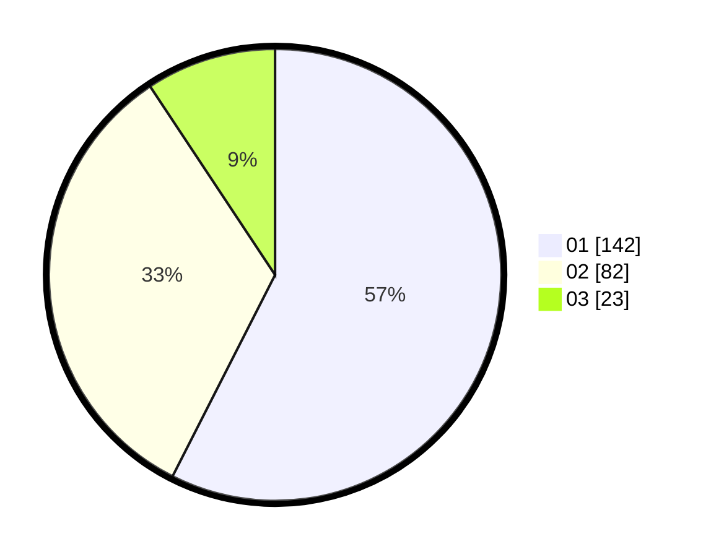

# Hasil

Hasil perolehan suara paslon dapat dilihat pada file paslon-01.txt, paslon-02.txt, dan paslon-03.txt.

Jika tidak ada, artinya data tersebut belum ada pada SIREKAP.

## Perolehan Suara

 * Paslon 01: **142**.
 * Paslon 02: **82**.
 * Paslon 03: **23**.

## Foto C Plano

https://sirekap-obj-formc.kpu.go.id/ecec/pemilu/ppwp/31/74/09/10/02/3174091002083-20240214-233045--4ab60f63-84ce-4465-8c02-db934969b7a5.jpg

https://sirekap-obj-formc.kpu.go.id/ecec/pemilu/ppwp/31/74/09/10/02/3174091002083-20240214-205701--76342edd-c166-4e1d-a0e7-c468fcda43b0.jpg

https://sirekap-obj-formc.kpu.go.id/ecec/pemilu/ppwp/31/74/09/10/02/3174091002083-20240214-205808--bb578ec1-fb50-47b3-bcde-0371c816c969.jpg

## DATA PEMILIH TETAP

Jumlah pemilih dalam DPT: **287**.
 * L: **145**.
 * P: **142**.

## DATA PENGGUNA HAK PILIH

Jumlah pengguna hak pilih dalam DPT: **236**.
 * L: **114**.
 * P: **122**.

Jumlah pengguna hak pilih dalam DPTb: **11**.
 * L: **7**.
 * P: **4**.

Jumlah pengguna hak pilih dalam DPK: **4**.
 * L: **2**.
 * P: **2**.

Jumlah pengguna hak pilih: **251**.
 * L: **123**.
 * P: **128**.

## JUMLAH SUARA SAH DAN TIDAK SAH

JUMLAH SELURUH SUARA SAH: **247**.

JUMLAH SUARA TIDAK SAH: **4**.

JUMLAH SELURUH SUARA SAH DAN SUARA TIDAK SAH: **251**.
