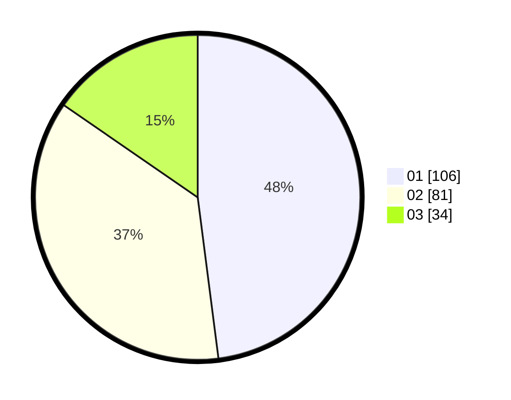

# Hasil

Hasil perolehan suara paslon dapat dilihat pada file paslon-01.txt, paslon-02.txt, dan paslon-03.txt.

Jika tidak ada, artinya data tersebut belum ada pada SIREKAP.

## Perolehan Suara

 * Paslon 01: **106**.
 * Paslon 02: **81**.
 * Paslon 03: **34**.

## Foto C Plano

https://sirekap-obj-formc.kpu.go.id/2351/pemilu/ppwp/31/74/09/10/02/3174091002091-20240216-142012--63004076-6c1a-4407-a4df-61795de38a09.jpg

https://sirekap-obj-formc.kpu.go.id/2351/pemilu/ppwp/31/74/09/10/02/3174091002091-20240216-142013--6065f8c3-c246-4c04-8f58-3b407f64c1b5.jpg

https://sirekap-obj-formc.kpu.go.id/2351/pemilu/ppwp/31/74/09/10/02/3174091002091-20240216-142012--acf65059-a3f1-4c2a-b2ad-9edcc01e3fe2.jpg

## DATA PEMILIH TETAP

Jumlah pemilih dalam DPT: **278**.
 * L: **141**.
 * P: **137**.

## DATA PENGGUNA HAK PILIH

Jumlah pengguna hak pilih dalam DPT: **220**.
 * L: **108**.
 * P: **112**.

Jumlah pengguna hak pilih dalam DPTb: **0**.
 * L: **0**.
 * P: **0**.

Jumlah pengguna hak pilih dalam DPK: **6**.
 * L: **4**.
 * P: **2**.

Jumlah pengguna hak pilih: **226**.
 * L: **112**.
 * P: **114**.

## JUMLAH SUARA SAH DAN TIDAK SAH

JUMLAH SELURUH SUARA SAH: **221**.

JUMLAH SUARA TIDAK SAH: **5**.

JUMLAH SELURUH SUARA SAH DAN SUARA TIDAK SAH: **226**.
