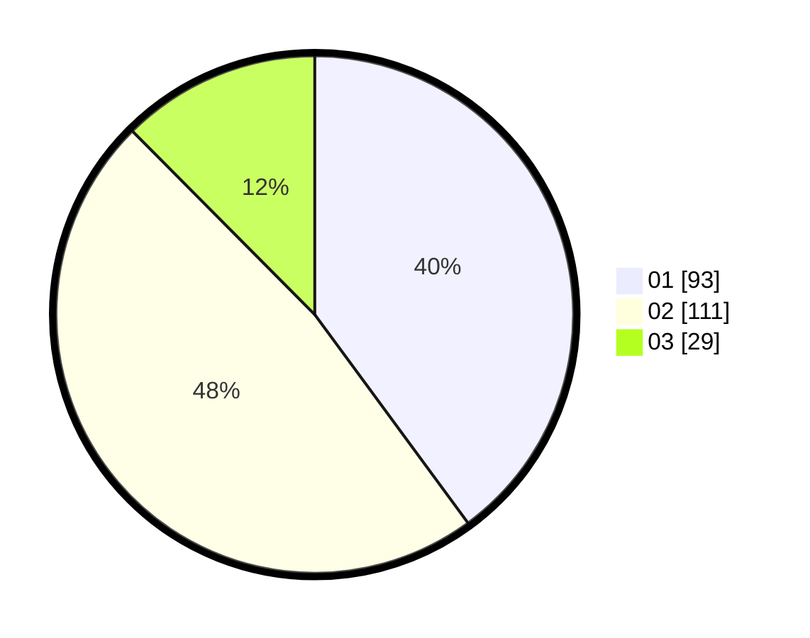

# Hasil

Hasil perolehan suara paslon dapat dilihat pada file paslon-01.txt, paslon-02.txt, dan paslon-03.txt.

Jika tidak ada, artinya data tersebut belum ada pada SIREKAP.

## Perolehan Suara

 * Paslon 01: **93**.
 * Paslon 02: **111**.
 * Paslon 03: **29**.

## Foto C Plano

https://sirekap-obj-formc.kpu.go.id/4a56/pemilu/ppwp/31/74/09/10/02/3174091002095-20240216-134751--5f325ca0-66e9-4bc7-a1d2-c11c2e2652b4.jpg

https://sirekap-obj-formc.kpu.go.id/4a56/pemilu/ppwp/31/74/09/10/02/3174091002095-20240216-134752--c483e1ec-7b36-42e9-a2b9-2da076d1f594.jpg

https://sirekap-obj-formc.kpu.go.id/4a56/pemilu/ppwp/31/74/09/10/02/3174091002095-20240216-134752--fcda0bd4-f0d3-4e43-a893-9dbacfc989aa.jpg

## DATA PEMILIH TETAP

Jumlah pemilih dalam DPT: **278**.
 * L: **130**.
 * P: **148**.

## DATA PENGGUNA HAK PILIH

Jumlah pengguna hak pilih dalam DPT: **239**.
 * L: **104**.
 * P: **135**.

Jumlah pengguna hak pilih dalam DPTb: **2**.
 * L: **1**.
 * P: **1**.

Jumlah pengguna hak pilih dalam DPK: **0**.
 * L: **0**.
 * P: **0**.

Jumlah pengguna hak pilih: **241**.
 * L: **105**.
 * P: **136**.

## JUMLAH SUARA SAH DAN TIDAK SAH

JUMLAH SELURUH SUARA SAH: **233**.

JUMLAH SUARA TIDAK SAH: **8**.

JUMLAH SELURUH SUARA SAH DAN SUARA TIDAK SAH: **241**.
