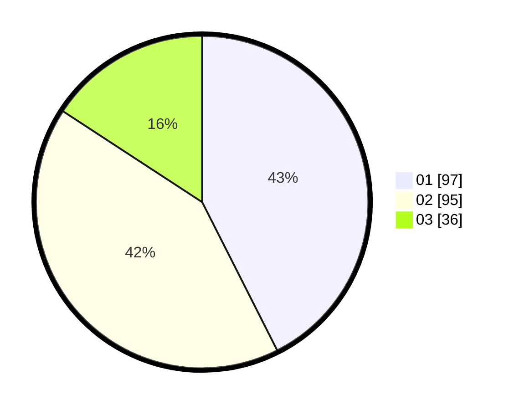

# Hasil

Hasil perolehan suara paslon dapat dilihat pada file paslon-01.txt, paslon-02.txt, dan paslon-03.txt.

Jika tidak ada, artinya data tersebut belum ada pada SIREKAP.

## Perolehan Suara

 * Paslon 01: **97**.
 * Paslon 02: **95**.
 * Paslon 03: **36**.

## Foto C Plano

https://sirekap-obj-formc.kpu.go.id/76a8/pemilu/ppwp/31/74/09/10/02/3174091002096-20240216-140153--0c5481fc-6ac3-43a4-95ba-5f432592088f.jpg

https://sirekap-obj-formc.kpu.go.id/76a8/pemilu/ppwp/31/74/09/10/02/3174091002096-20240216-140154--5928501a-72ab-4694-9041-ebadb0d4cc0c.jpg

https://sirekap-obj-formc.kpu.go.id/76a8/pemilu/ppwp/31/74/09/10/02/3174091002096-20240216-140154--6aac570f-a31e-45b3-ad06-0ab0d6d80510.jpg

## DATA PEMILIH TETAP

Jumlah pemilih dalam DPT: **279**.
 * L: **137**.
 * P: **142**.

## DATA PENGGUNA HAK PILIH

Jumlah pengguna hak pilih dalam DPT: **229**.
 * L: **111**.
 * P: **118**.

Jumlah pengguna hak pilih dalam DPTb: **0**.
 * L: **0**.
 * P: **0**.

Jumlah pengguna hak pilih dalam DPK: **3**.
 * L: **2**.
 * P: **1**.

Jumlah pengguna hak pilih: **232**.
 * L: **113**.
 * P: **119**.

## JUMLAH SUARA SAH DAN TIDAK SAH

JUMLAH SELURUH SUARA SAH: **228**.

JUMLAH SUARA TIDAK SAH: **4**.

JUMLAH SELURUH SUARA SAH DAN SUARA TIDAK SAH: **232**.
