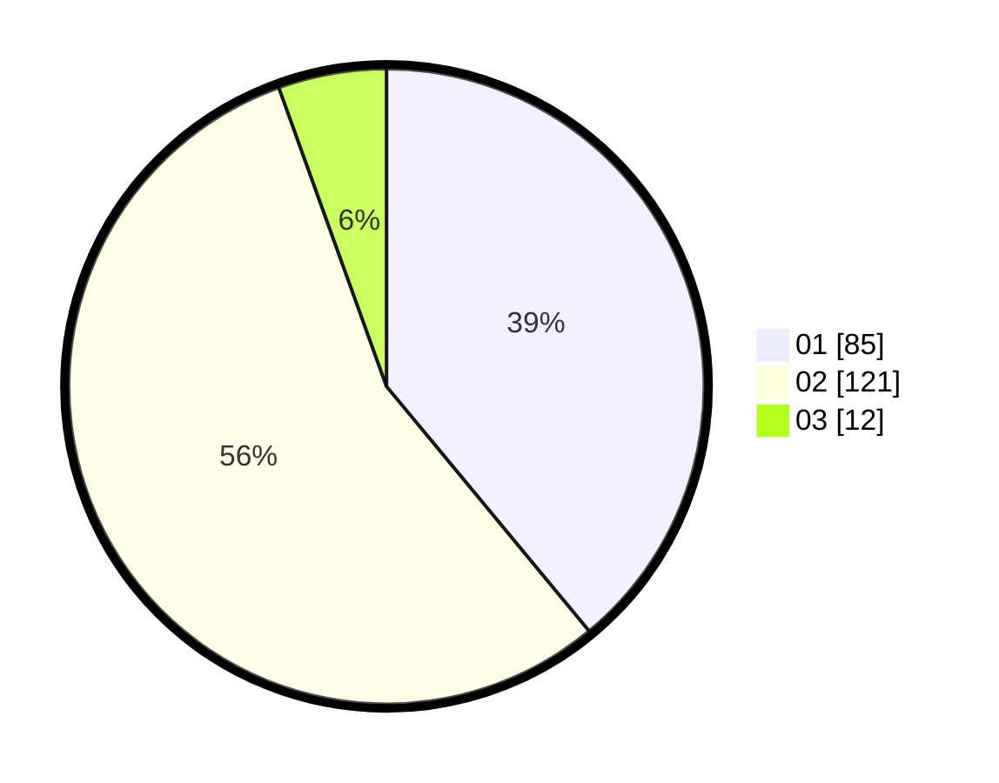

# Hasil

Hasil perolehan suara paslon dapat dilihat pada file paslon-01.txt, paslon-02.txt, dan paslon-03.txt.

Jika tidak ada, artinya data tersebut belum ada pada SIREKAP.

## Perolehan Suara

 * Paslon 01: **85**.
 * Paslon 02: **121**.
 * Paslon 03: **12**.

## Foto C Plano

https://sirekap-obj-formc.kpu.go.id/1971/pemilu/ppwp/31/74/09/10/02/3174091002101-20240214-155659--bd39d224-58b4-4802-a418-69182e5956aa.jpg

https://sirekap-obj-formc.kpu.go.id/1971/pemilu/ppwp/31/74/09/10/02/3174091002101-20240214-155837--10ffd1da-1411-45a6-8382-bf7d5df4a2b4.jpg

https://sirekap-obj-formc.kpu.go.id/1971/pemilu/ppwp/31/74/09/10/02/3174091002101-20240214-160122--dfc0437c-79b5-42e6-85ac-b5d12cb11874.jpg

## DATA PEMILIH TETAP

Jumlah pemilih dalam DPT: **266**.
 * L: **128**.
 * P: **138**.

## DATA PENGGUNA HAK PILIH

Jumlah pengguna hak pilih dalam DPT: **216**.
 * L: **95**.
 * P: **121**.

Jumlah pengguna hak pilih dalam DPTb: **0**.
 * L: **0**.
 * P: **0**.

Jumlah pengguna hak pilih dalam DPK: **2**.
 * L: **1**.
 * P: **1**.

Jumlah pengguna hak pilih: **218**.
 * L: **96**.
 * P: **122**.

## JUMLAH SUARA SAH DAN TIDAK SAH

JUMLAH SELURUH SUARA SAH: **218**.

JUMLAH SUARA TIDAK SAH: **0**.

JUMLAH SELURUH SUARA SAH DAN SUARA TIDAK SAH: **218**.
