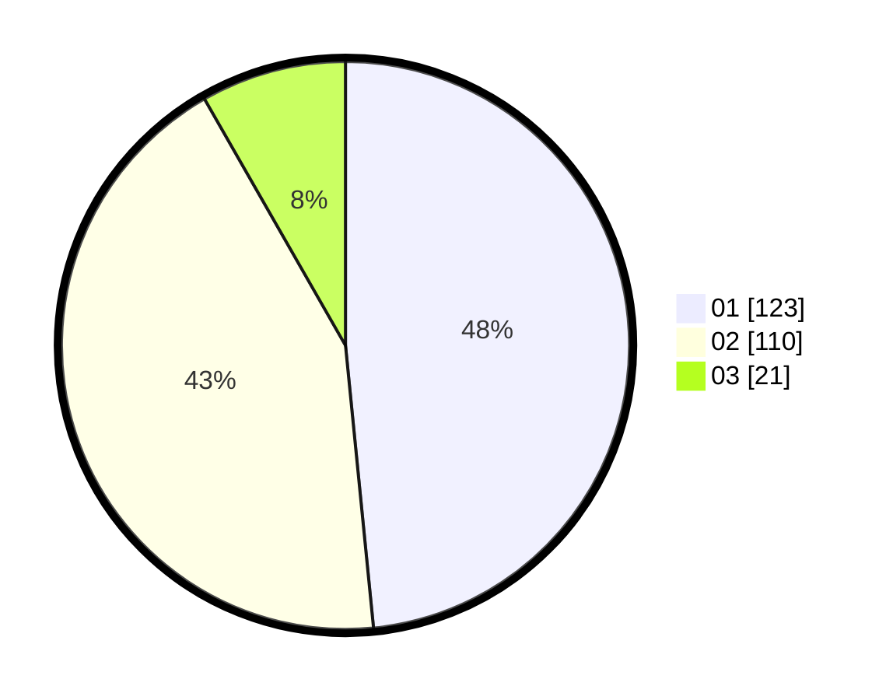

# Hasil

Hasil perolehan suara paslon dapat dilihat pada file paslon-01.txt, paslon-02.txt, dan paslon-03.txt.

Jika tidak ada, artinya data tersebut belum ada pada SIREKAP.

## Perolehan Suara

 * Paslon 01: **123**.
 * Paslon 02: **110**.
 * Paslon 03: **21**.

## Foto C Plano

https://sirekap-obj-formc.kpu.go.id/f0d0/pemilu/ppwp/31/74/09/10/02/3174091002112-20240216-071650--a60d6e6a-e91b-4e04-9fa1-2b3422979f12.jpg

https://sirekap-obj-formc.kpu.go.id/f0d0/pemilu/ppwp/31/74/09/10/02/3174091002112-20240216-063531--01120e12-726d-43a8-ae42-a566376877a3.jpg

https://sirekap-obj-formc.kpu.go.id/f0d0/pemilu/ppwp/31/74/09/10/02/3174091002112-20240216-063519--a41fca32-338f-47a9-a2be-dc8db1eee82b.jpg

## DATA PEMILIH TETAP

Jumlah pemilih dalam DPT: **286**.
 * L: **129**.
 * P: **157**.

## DATA PENGGUNA HAK PILIH

Jumlah pengguna hak pilih dalam DPT: **252**.
 * L: **111**.
 * P: **141**.

Jumlah pengguna hak pilih dalam DPTb: **3**.
 * L: **1**.
 * P: **2**.

Jumlah pengguna hak pilih dalam DPK: **6**.
 * L: **3**.
 * P: **3**.

Jumlah pengguna hak pilih: **261**.
 * L: **115**.
 * P: **146**.

## JUMLAH SUARA SAH DAN TIDAK SAH

JUMLAH SELURUH SUARA SAH: **254**.

JUMLAH SUARA TIDAK SAH: **7**.

JUMLAH SELURUH SUARA SAH DAN SUARA TIDAK SAH: **261**.
