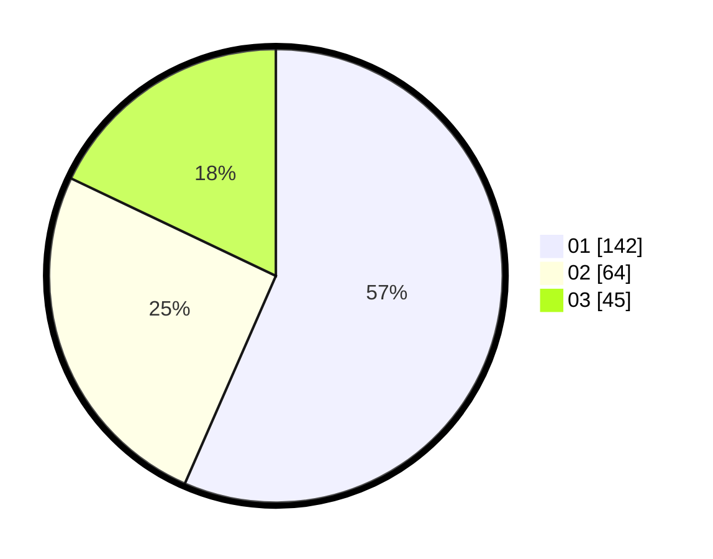

# Hasil

Hasil perolehan suara paslon dapat dilihat pada file paslon-01.txt, paslon-02.txt, dan paslon-03.txt.

Jika tidak ada, artinya data tersebut belum ada pada SIREKAP.

## Perolehan Suara

 * Paslon 01: **142**.
 * Paslon 02: **64**.
 * Paslon 03: **45**.

## Foto C Plano

https://sirekap-obj-formc.kpu.go.id/de4e/pemilu/ppwp/31/74/09/10/02/3174091002120-20240217-223533--9ef38369-b90d-4377-aef7-4ccccb52f3a3.jpg

https://sirekap-obj-formc.kpu.go.id/de4e/pemilu/ppwp/31/74/09/10/02/3174091002120-20240217-223756--59d87c4d-4cb9-4e23-b5fa-ac18e52b8d5a.jpg

https://sirekap-obj-formc.kpu.go.id/de4e/pemilu/ppwp/31/74/09/10/02/3174091002120-20240217-223835--e52ca424-012d-4279-911b-ce938dcd2d5a.jpg

## DATA PEMILIH TETAP

Jumlah pemilih dalam DPT: **266**.
 * L: **134**.
 * P: **132**.

## DATA PENGGUNA HAK PILIH

Jumlah pengguna hak pilih dalam DPT: **234**.
 * L: **112**.
 * P: **122**.

Jumlah pengguna hak pilih dalam DPTb: **13**.
 * L: **6**.
 * P: **7**.

Jumlah pengguna hak pilih dalam DPK: **6**.
 * L: **4**.
 * P: **2**.

Jumlah pengguna hak pilih: **253**.
 * L: **122**.
 * P: **131**.

## JUMLAH SUARA SAH DAN TIDAK SAH

JUMLAH SELURUH SUARA SAH: **251**.

JUMLAH SUARA TIDAK SAH: **2**.

JUMLAH SELURUH SUARA SAH DAN SUARA TIDAK SAH: **253**.
