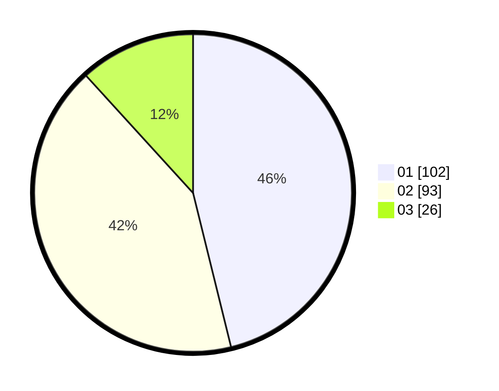

# Hasil

Hasil perolehan suara paslon dapat dilihat pada file paslon-01.txt, paslon-02.txt, dan paslon-03.txt.

Jika tidak ada, artinya data tersebut belum ada pada SIREKAP.

## Perolehan Suara

 * Paslon 01: **102**.
 * Paslon 02: **93**.
 * Paslon 03: **26**.

## Foto C Plano

https://sirekap-obj-formc.kpu.go.id/00c7/pemilu/ppwp/31/74/09/10/02/3174091002121-20240214-194555--ebc5be86-a165-4334-acf6-4ab4de4a60d1.jpg

https://sirekap-obj-formc.kpu.go.id/00c7/pemilu/ppwp/31/74/09/10/02/3174091002121-20240214-190945--f7584d11-6f36-42a7-9470-5a11f32744bb.jpg

https://sirekap-obj-formc.kpu.go.id/00c7/pemilu/ppwp/31/74/09/10/02/3174091002121-20240214-195302--d7a91a31-6a22-4c9c-a2dc-47fc104efee4.jpg

## DATA PEMILIH TETAP

Jumlah pemilih dalam DPT: **281**.
 * L: **139**.
 * P: **142**.

## DATA PENGGUNA HAK PILIH

Jumlah pengguna hak pilih dalam DPT: **219**.
 * L: **107**.
 * P: **112**.

Jumlah pengguna hak pilih dalam DPTb: **5**.
 * L: **1**.
 * P: **4**.

Jumlah pengguna hak pilih dalam DPK: **0**.
 * L: **0**.
 * P: **0**.

Jumlah pengguna hak pilih: **224**.
 * L: **108**.
 * P: **116**.

## JUMLAH SUARA SAH DAN TIDAK SAH

JUMLAH SELURUH SUARA SAH: **221**.

JUMLAH SUARA TIDAK SAH: **3**.

JUMLAH SELURUH SUARA SAH DAN SUARA TIDAK SAH: **224**.
