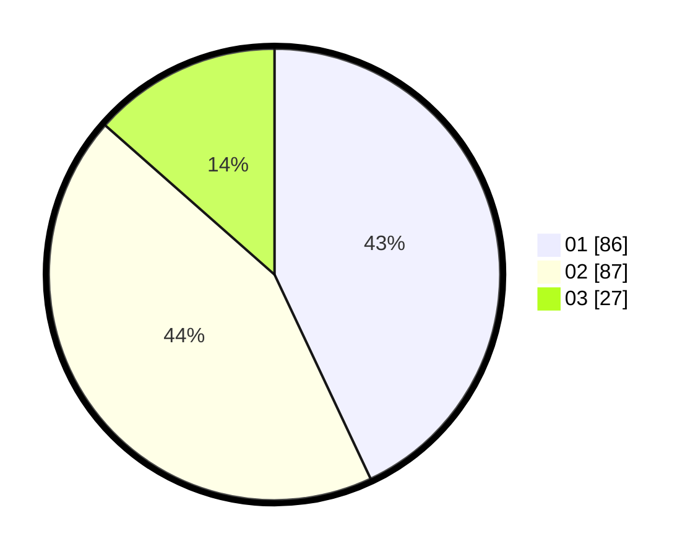

# Hasil

Hasil perolehan suara paslon dapat dilihat pada file paslon-01.txt, paslon-02.txt, dan paslon-03.txt.

Jika tidak ada, artinya data tersebut belum ada pada SIREKAP.

## Perolehan Suara

 * Paslon 01: **86**.
 * Paslon 02: **87**.
 * Paslon 03: **27**.

## Foto C Plano

https://sirekap-obj-formc.kpu.go.id/f4a0/pemilu/ppwp/31/74/09/10/02/3174091002125-20240214-232406--8288167d-1e5e-4b42-a479-b9358adc6cfe.jpg

https://sirekap-obj-formc.kpu.go.id/f4a0/pemilu/ppwp/31/74/09/10/02/3174091002125-20240214-232435--ec414574-4774-4007-819f-4a0c5a9fb13b.jpg

https://sirekap-obj-formc.kpu.go.id/f4a0/pemilu/ppwp/31/74/09/10/02/3174091002125-20240214-232518--d5cb4957-c429-4648-bb01-b5f177277d6b.jpg

## DATA PEMILIH TETAP

Jumlah pemilih dalam DPT: **255**.
 * L: **118**.
 * P: **137**.

## DATA PENGGUNA HAK PILIH

Jumlah pengguna hak pilih dalam DPT: **201**.
 * L: **91**.
 * P: **110**.

Jumlah pengguna hak pilih dalam DPTb: **0**.
 * L: **0**.
 * P: **0**.

Jumlah pengguna hak pilih dalam DPK: **1**.
 * L: **1**.
 * P: **0**.

Jumlah pengguna hak pilih: **202**.
 * L: **92**.
 * P: **110**.

## JUMLAH SUARA SAH DAN TIDAK SAH

JUMLAH SELURUH SUARA SAH: **200**.

JUMLAH SUARA TIDAK SAH: **2**.

JUMLAH SELURUH SUARA SAH DAN SUARA TIDAK SAH: **202**.
