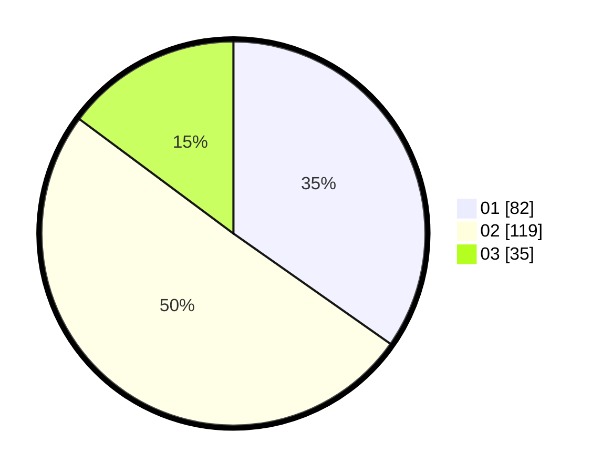

# Hasil

Hasil perolehan suara paslon dapat dilihat pada file paslon-01.txt, paslon-02.txt, dan paslon-03.txt.

Jika tidak ada, artinya data tersebut belum ada pada SIREKAP.

## Perolehan Suara

 * Paslon 01: **82**.
 * Paslon 02: **119**.
 * Paslon 03: **35**.

## Foto C Plano

https://sirekap-obj-formc.kpu.go.id/6cb8/pemilu/ppwp/31/74/09/10/02/3174091002132-20240216-150134--39e7ac09-f4f7-4adf-86ea-420fc97bf6f1.jpg

https://sirekap-obj-formc.kpu.go.id/6cb8/pemilu/ppwp/31/74/09/10/02/3174091002132-20240216-150136--fcb528a2-3504-40e4-a3b0-d505e0ebf70b.jpg

https://sirekap-obj-formc.kpu.go.id/6cb8/pemilu/ppwp/31/74/09/10/02/3174091002132-20240216-150135--8d2033b0-a0eb-46f1-8da3-278a9e636022.jpg

## DATA PEMILIH TETAP

Jumlah pemilih dalam DPT: **276**.
 * L: **140**.
 * P: **136**.

## DATA PENGGUNA HAK PILIH

Jumlah pengguna hak pilih dalam DPT: **241**.
 * L: **115**.
 * P: **126**.

Jumlah pengguna hak pilih dalam DPTb: **0**.
 * L: **0**.
 * P: **0**.

Jumlah pengguna hak pilih dalam DPK: **0**.
 * L: **0**.
 * P: **0**.

Jumlah pengguna hak pilih: **241**.
 * L: **115**.
 * P: **126**.

## JUMLAH SUARA SAH DAN TIDAK SAH

JUMLAH SELURUH SUARA SAH: **236**.

JUMLAH SUARA TIDAK SAH: **5**.

JUMLAH SELURUH SUARA SAH DAN SUARA TIDAK SAH: **241**.
