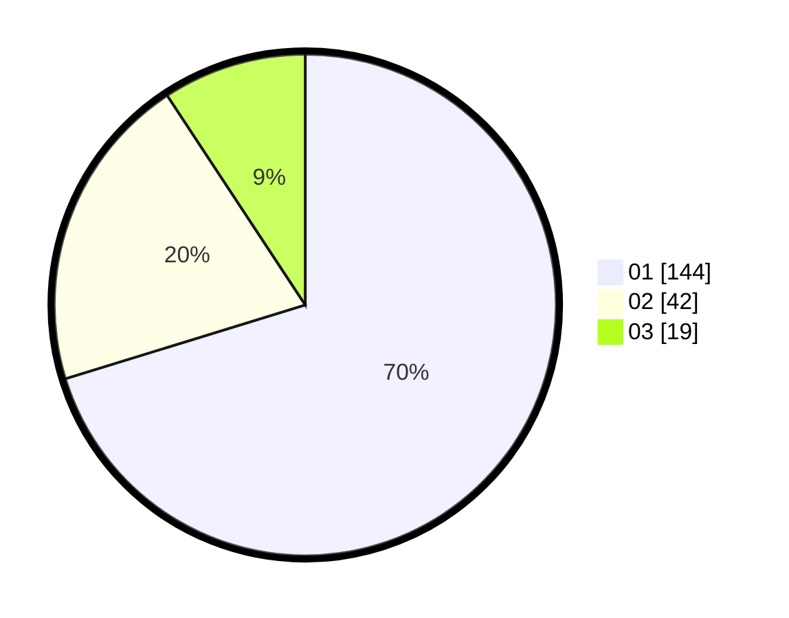

# Hasil

Hasil perolehan suara paslon dapat dilihat pada file paslon-01.txt, paslon-02.txt, dan paslon-03.txt.

Jika tidak ada, artinya data tersebut belum ada pada SIREKAP.

## Perolehan Suara

 * Paslon 01: **144**.
 * Paslon 02: **42**.
 * Paslon 03: **19**.

## Foto C Plano

https://sirekap-obj-formc.kpu.go.id/8fad/pemilu/ppwp/31/74/09/10/02/3174091002144-20240214-190700--ca1e23ed-3409-4c4e-9ca1-3f8a6f794d4f.jpg

https://sirekap-obj-formc.kpu.go.id/8fad/pemilu/ppwp/31/74/09/10/02/3174091002144-20240214-190920--e3aee699-e82c-4e7b-a95d-3a9fe08d410e.jpg

https://sirekap-obj-formc.kpu.go.id/8fad/pemilu/ppwp/31/74/09/10/02/3174091002144-20240214-192750--ab2f22b6-1650-4cb7-82f6-300eab063f12.jpg

## DATA PEMILIH TETAP

Jumlah pemilih dalam DPT: **240**.
 * L: **119**.
 * P: **121**.

## DATA PENGGUNA HAK PILIH

Jumlah pengguna hak pilih dalam DPT: **208**.
 * L: **102**.
 * P: **106**.

Jumlah pengguna hak pilih dalam DPTb: **0**.
 * L: **0**.
 * P: **0**.

Jumlah pengguna hak pilih dalam DPK: **0**.
 * L: **0**.
 * P: **0**.

Jumlah pengguna hak pilih: **208**.
 * L: **102**.
 * P: **106**.

## JUMLAH SUARA SAH DAN TIDAK SAH

JUMLAH SELURUH SUARA SAH: **205**.

JUMLAH SUARA TIDAK SAH: **3**.

JUMLAH SELURUH SUARA SAH DAN SUARA TIDAK SAH: **208**.
