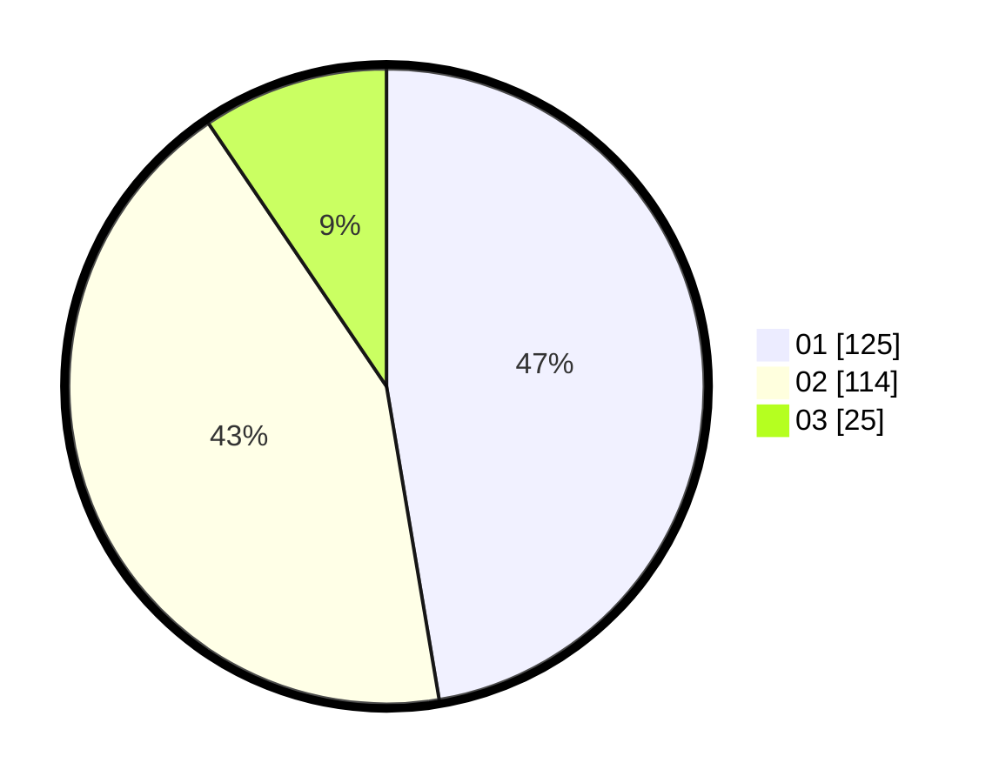

# Hasil

Hasil perolehan suara paslon dapat dilihat pada file paslon-01.txt, paslon-02.txt, dan paslon-03.txt.

Jika tidak ada, artinya data tersebut belum ada pada SIREKAP.

## Perolehan Suara

 * Paslon 01: **125**.
 * Paslon 02: **114**.
 * Paslon 03: **25**.

## Foto C Plano

https://sirekap-obj-formc.kpu.go.id/c73d/pemilu/ppwp/31/74/09/10/02/3174091002154-20240214-221639--9f46ee8e-c51e-41c0-9a0d-a0e8c9387ed5.jpg

https://sirekap-obj-formc.kpu.go.id/c73d/pemilu/ppwp/31/74/09/10/02/3174091002154-20240214-221739--60ec3342-fb4a-4885-b565-8895c6c85c13.jpg

https://sirekap-obj-formc.kpu.go.id/c73d/pemilu/ppwp/31/74/09/10/02/3174091002154-20240214-221805--c983cd63-6658-4948-8ae7-0d5e12e765c8.jpg
