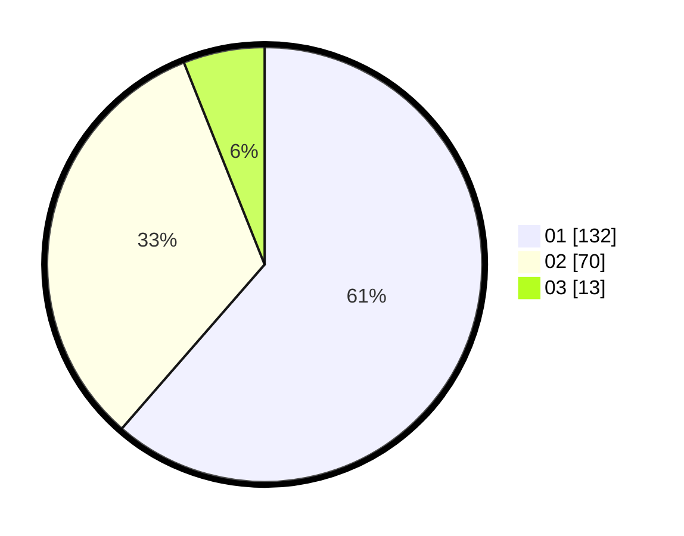

# Hasil

Hasil perolehan suara paslon dapat dilihat pada file paslon-01.txt, paslon-02.txt, dan paslon-03.txt.

Jika tidak ada, artinya data tersebut belum ada pada SIREKAP.

## Perolehan Suara

 * Paslon 01: **132**.
 * Paslon 02: **70**.
 * Paslon 03: **13**.

## Foto C Plano

https://sirekap-obj-formc.kpu.go.id/53c8/pemilu/ppwp/31/74/09/10/02/3174091002156-20240214-233313--90923dee-98ac-4186-84b8-4644a98a90b9.jpg

https://sirekap-obj-formc.kpu.go.id/53c8/pemilu/ppwp/31/74/09/10/02/3174091002156-20240214-233604--21fdbe7d-e176-4de0-9a87-d79a6e26cbfc.jpg

https://sirekap-obj-formc.kpu.go.id/53c8/pemilu/ppwp/31/74/09/10/02/3174091002156-20240214-233714--55ff770e-656b-4b38-a1ca-4e78981d8f1b.jpg

## DATA PEMILIH TETAP

Jumlah pemilih dalam DPT: **244**.
 * L: **111**.
 * P: **133**.

## DATA PENGGUNA HAK PILIH

Jumlah pengguna hak pilih dalam DPT: **210**.
 * L: **93**.
 * P: **117**.

Jumlah pengguna hak pilih dalam DPTb: **2**.
 * L: **1**.
 * P: **1**.

Jumlah pengguna hak pilih dalam DPK: **8**.
 * L: **1**.
 * P: **7**.

Jumlah pengguna hak pilih: **220**.
 * L: **95**.
 * P: **125**.

## JUMLAH SUARA SAH DAN TIDAK SAH

JUMLAH SELURUH SUARA SAH: **215**.

JUMLAH SUARA TIDAK SAH: **5**.

JUMLAH SELURUH SUARA SAH DAN SUARA TIDAK SAH: **220**.
