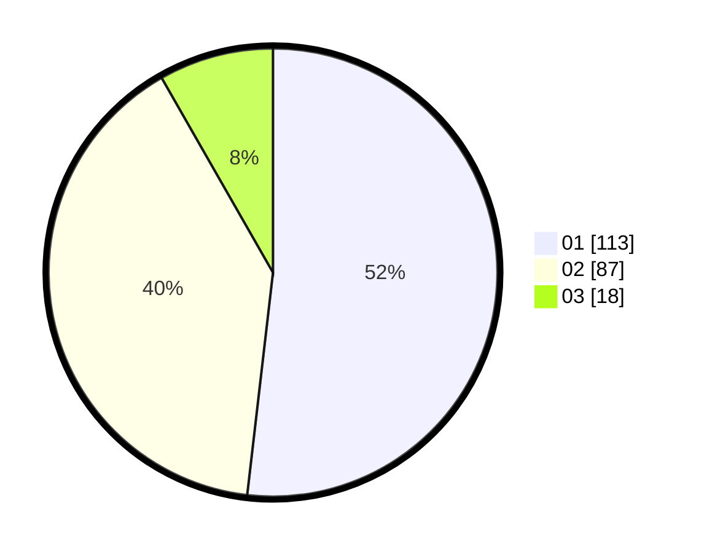

# Hasil

Hasil perolehan suara paslon dapat dilihat pada file paslon-01.txt, paslon-02.txt, dan paslon-03.txt.

Jika tidak ada, artinya data tersebut belum ada pada SIREKAP.

## Perolehan Suara

 * Paslon 01: **113**.
 * Paslon 02: **87**.
 * Paslon 03: **18**.

## Foto C Plano

https://sirekap-obj-formc.kpu.go.id/ec55/pemilu/ppwp/31/74/09/10/02/3174091002158-20240214-205359--c9507d4b-ed2a-47e5-be7d-7340bb71f4a3.jpg

https://sirekap-obj-formc.kpu.go.id/ec55/pemilu/ppwp/31/74/09/10/02/3174091002158-20240214-205612--dbe05f6a-5c4c-44a8-a745-bffb91aa454e.jpg

https://sirekap-obj-formc.kpu.go.id/ec55/pemilu/ppwp/31/74/09/10/02/3174091002158-20240214-205739--53e3f25a-ba21-4751-a985-d4dbbb30936e.jpg

## DATA PEMILIH TETAP

Jumlah pemilih dalam DPT: **258**.
 * L: **139**.
 * P: **119**.

## DATA PENGGUNA HAK PILIH

Jumlah pengguna hak pilih dalam DPT: **222**.
 * L: **115**.
 * P: **107**.

Jumlah pengguna hak pilih dalam DPTb: **1**.
 * L: **1**.
 * P: **0**.

Jumlah pengguna hak pilih dalam DPK: **0**.
 * L: **0**.
 * P: **0**.

Jumlah pengguna hak pilih: **223**.
 * L: **116**.
 * P: **107**.

## JUMLAH SUARA SAH DAN TIDAK SAH

JUMLAH SELURUH SUARA SAH: **218**.

JUMLAH SUARA TIDAK SAH: **5**.

JUMLAH SELURUH SUARA SAH DAN SUARA TIDAK SAH: **223**.
