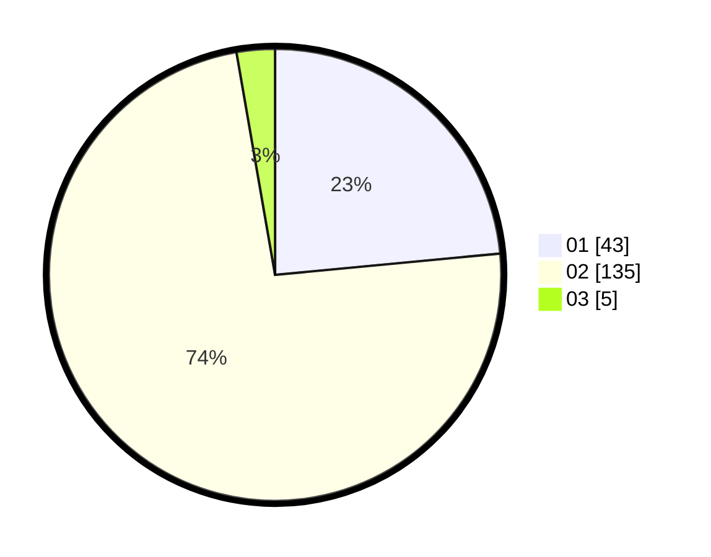

# Hasil

Hasil perolehan suara paslon dapat dilihat pada file paslon-01.txt, paslon-02.txt, dan paslon-03.txt.

Jika tidak ada, artinya data tersebut belum ada pada SIREKAP.

## Perolehan Suara

 * Paslon 01: **43**.
 * Paslon 02: **135**.
 * Paslon 03: **5**.

## Foto C Plano

https://sirekap-obj-formc.kpu.go.id/6d96/pemilu/ppwp/31/74/09/10/02/3174091002176-20240214-155221--d6231ce1-0fbd-478e-bcbb-1b9ada40d6bb.jpg

https://sirekap-obj-formc.kpu.go.id/6d96/pemilu/ppwp/31/74/09/10/02/3174091002176-20240214-155745--cffb547f-462d-4095-988b-323ffdb87eec.jpg

https://sirekap-obj-formc.kpu.go.id/6d96/pemilu/ppwp/31/74/09/10/02/3174091002176-20240215-064450--c1f3de48-5c2b-4c43-9dfe-de40aa13ba11.jpg

## DATA PEMILIH TETAP

Jumlah pemilih dalam DPT: **248**.
 * L: **58**.
 * P: **190**.

## DATA PENGGUNA HAK PILIH

Jumlah pengguna hak pilih dalam DPT: **171**.
 * L: **29**.
 * P: **142**.

Jumlah pengguna hak pilih dalam DPTb: **0**.
 * L: **0**.
 * P: **0**.

Jumlah pengguna hak pilih dalam DPK: **12**.
 * L: **8**.
 * P: **4**.

Jumlah pengguna hak pilih: **183**.
 * L: **37**.
 * P: **146**.

## JUMLAH SUARA SAH DAN TIDAK SAH

JUMLAH SELURUH SUARA SAH: **183**.

JUMLAH SUARA TIDAK SAH: **0**.

JUMLAH SELURUH SUARA SAH DAN SUARA TIDAK SAH: **183**.
