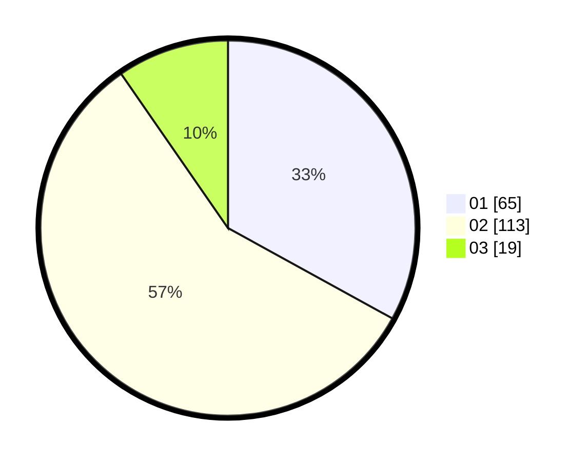

# Hasil

Hasil perolehan suara paslon dapat dilihat pada file paslon-01.txt, paslon-02.txt, dan paslon-03.txt.

Jika tidak ada, artinya data tersebut belum ada pada SIREKAP.

## Perolehan Suara

 * Paslon 01: **65**.
 * Paslon 02: **113**.
 * Paslon 03: **19**.

## Foto C Plano

https://sirekap-obj-formc.kpu.go.id/1680/pemilu/ppwp/31/74/09/10/02/3174091002189-20240215-224323--7c2eebea-c98e-45b4-b454-ec1eeb24ff21.jpg

https://sirekap-obj-formc.kpu.go.id/1680/pemilu/ppwp/31/74/09/10/02/3174091002189-20240215-224325--74818433-b407-46d0-9202-3e18ca64ba45.jpg

https://sirekap-obj-formc.kpu.go.id/1680/pemilu/ppwp/31/74/09/10/02/3174091002189-20240215-224324--20eb1f61-eb55-49bc-b8b8-d8531ee86f0e.jpg

## DATA PEMILIH TETAP

Jumlah pemilih dalam DPT: **233**.
 * L: **108**.
 * P: **125**.

## DATA PENGGUNA HAK PILIH

Jumlah pengguna hak pilih dalam DPT: **196**.
 * L: **85**.
 * P: **111**.

Jumlah pengguna hak pilih dalam DPTb: **1**.
 * L: **0**.
 * P: **1**.

Jumlah pengguna hak pilih dalam DPK: **1**.
 * L: **0**.
 * P: **1**.

Jumlah pengguna hak pilih: **198**.
 * L: **85**.
 * P: **113**.

## JUMLAH SUARA SAH DAN TIDAK SAH

JUMLAH SELURUH SUARA SAH: **197**.

JUMLAH SUARA TIDAK SAH: **1**.

JUMLAH SELURUH SUARA SAH DAN SUARA TIDAK SAH: **198**.
