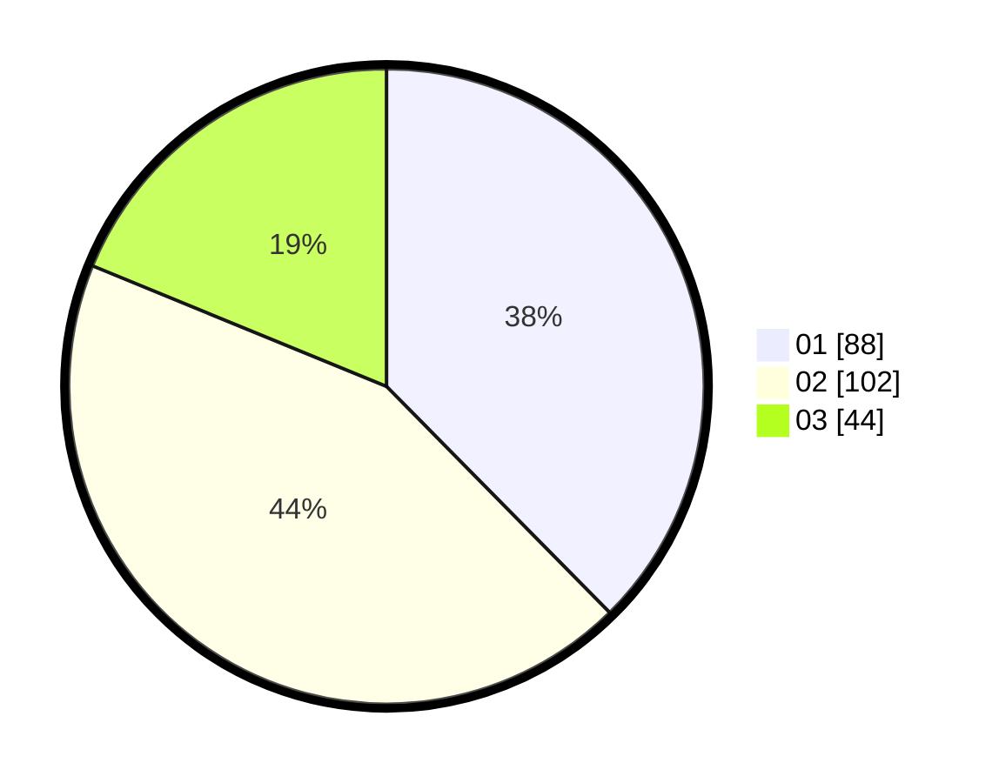

# Hasil

Hasil perolehan suara paslon dapat dilihat pada file paslon-01.txt, paslon-02.txt, dan paslon-03.txt.

Jika tidak ada, artinya data tersebut belum ada pada SIREKAP.

## Perolehan Suara

 * Paslon 01: **88**.
 * Paslon 02: **102**.
 * Paslon 03: **44**.

## Foto C Plano

https://sirekap-obj-formc.kpu.go.id/2303/pemilu/ppwp/31/74/09/10/03/3174091003009-20240214-215953--6d52c70f-7c57-4c67-8756-952ea3fce561.jpg

https://sirekap-obj-formc.kpu.go.id/2303/pemilu/ppwp/31/74/09/10/03/3174091003009-20240214-220134--e778690b-8cae-4644-afec-b89d6b04723d.jpg

https://sirekap-obj-formc.kpu.go.id/2303/pemilu/ppwp/31/74/09/10/03/3174091003009-20240214-220231--d8f0cfa3-4521-4a2c-a0b6-2ad3c0fd90b0.jpg

## DATA PEMILIH TETAP

Jumlah pemilih dalam DPT: **281**.
 * L: **141**.
 * P: **140**.

## DATA PENGGUNA HAK PILIH

Jumlah pengguna hak pilih dalam DPT: **231**.
 * L: **113**.
 * P: **118**.

Jumlah pengguna hak pilih dalam DPTb: **5**.
 * L: **1**.
 * P: **4**.

Jumlah pengguna hak pilih dalam DPK: **1**.
 * L: **1**.
 * P: **0**.

Jumlah pengguna hak pilih: **237**.
 * L: **115**.
 * P: **122**.

## JUMLAH SUARA SAH DAN TIDAK SAH

JUMLAH SELURUH SUARA SAH: **234**.

JUMLAH SUARA TIDAK SAH: **3**.

JUMLAH SELURUH SUARA SAH DAN SUARA TIDAK SAH: **237**.
