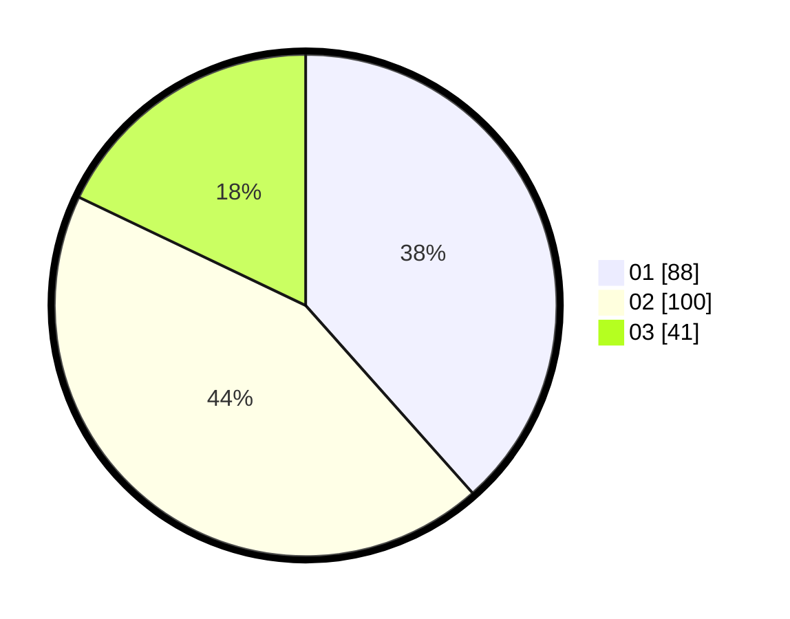

# Hasil

Hasil perolehan suara paslon dapat dilihat pada file paslon-01.txt, paslon-02.txt, dan paslon-03.txt.

Jika tidak ada, artinya data tersebut belum ada pada SIREKAP.

## Perolehan Suara

 * Paslon 01: **88**.
 * Paslon 02: **100**.
 * Paslon 03: **41**.

## Foto C Plano

https://sirekap-obj-formc.kpu.go.id/4b9c/pemilu/ppwp/31/74/09/10/03/3174091003010-20240214-214354--cf3d50f7-4124-442c-a2c9-a7fb69767577.jpg

https://sirekap-obj-formc.kpu.go.id/4b9c/pemilu/ppwp/31/74/09/10/03/3174091003010-20240214-211002--ecb3a928-9c1d-444f-9a8f-7632fb128b05.jpg

https://sirekap-obj-formc.kpu.go.id/4b9c/pemilu/ppwp/31/74/09/10/03/3174091003010-20240214-205505--49cfaa28-257c-4256-aea7-409e60c4d96f.jpg
