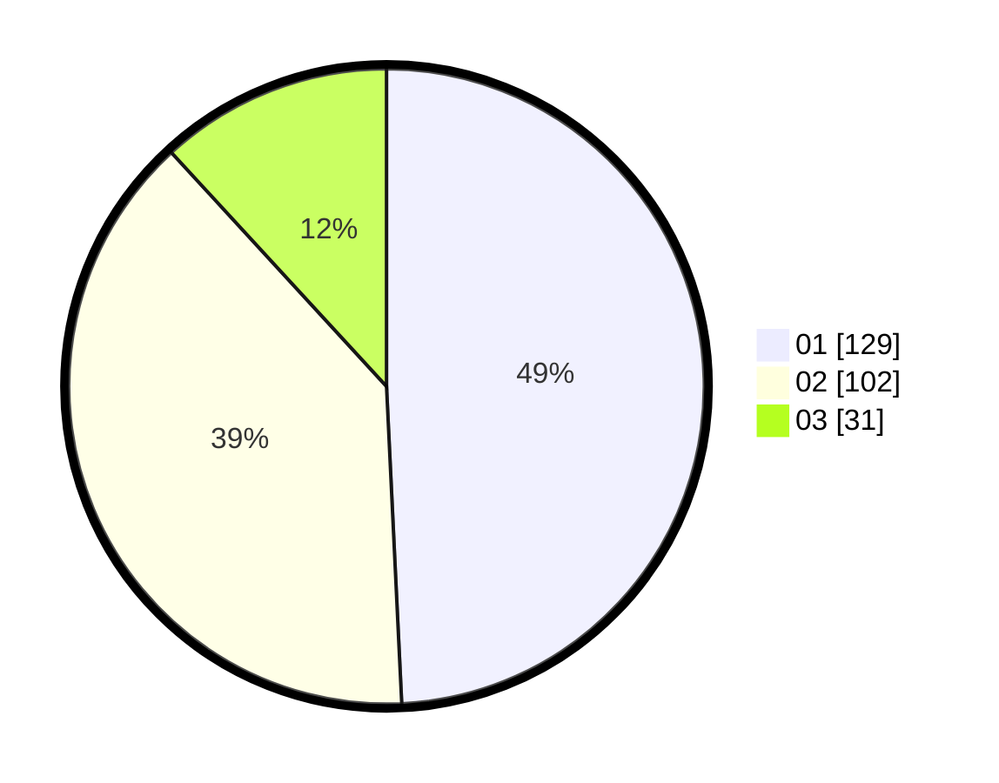

# Hasil

Hasil perolehan suara paslon dapat dilihat pada file paslon-01.txt, paslon-02.txt, dan paslon-03.txt.

Jika tidak ada, artinya data tersebut belum ada pada SIREKAP.

## Perolehan Suara

 * Paslon 01: **129**.
 * Paslon 02: **102**.
 * Paslon 03: **31**.

## Foto C Plano

https://sirekap-obj-formc.kpu.go.id/0e1f/pemilu/ppwp/31/74/09/10/03/3174091003022-20240214-224518--28a3bd5d-a556-472f-8d39-50f77f27e695.jpg

https://sirekap-obj-formc.kpu.go.id/0e1f/pemilu/ppwp/31/74/09/10/03/3174091003022-20240214-224627--70806748-59f6-41e5-9ebe-b7f92907dc11.jpg

https://sirekap-obj-formc.kpu.go.id/0e1f/pemilu/ppwp/31/74/09/10/03/3174091003022-20240214-224743--397a2d50-14bc-4d38-a8dd-6a3951b53cf3.jpg

## DATA PEMILIH TETAP

Jumlah pemilih dalam DPT: **299**.
 * L: **144**.
 * P: **155**.

## DATA PENGGUNA HAK PILIH

Jumlah pengguna hak pilih dalam DPT: **259**.
 * L: **128**.
 * P: **131**.

Jumlah pengguna hak pilih dalam DPTb: **7**.
 * L: **3**.
 * P: **4**.

Jumlah pengguna hak pilih dalam DPK: **2**.
 * L: **0**.
 * P: **2**.

Jumlah pengguna hak pilih: **268**.
 * L: **131**.
 * P: **137**.

## JUMLAH SUARA SAH DAN TIDAK SAH

JUMLAH SELURUH SUARA SAH: **262**.

JUMLAH SUARA TIDAK SAH: **6**.

JUMLAH SELURUH SUARA SAH DAN SUARA TIDAK SAH: **268**.
