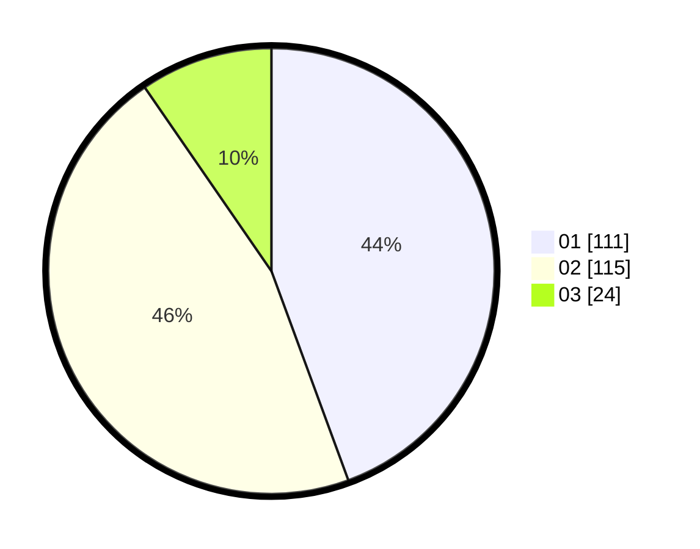

# Hasil

Hasil perolehan suara paslon dapat dilihat pada file paslon-01.txt, paslon-02.txt, dan paslon-03.txt.

Jika tidak ada, artinya data tersebut belum ada pada SIREKAP.

## Perolehan Suara

 * Paslon 01: **111**.
 * Paslon 02: **115**.
 * Paslon 03: **24**.

## Foto C Plano

https://sirekap-obj-formc.kpu.go.id/a2c3/pemilu/ppwp/31/74/09/10/03/3174091003023-20240214-231531--27a77fb6-5974-41e7-8d17-58b27bc2cb36.jpg

https://sirekap-obj-formc.kpu.go.id/a2c3/pemilu/ppwp/31/74/09/10/03/3174091003023-20240214-231700--b166fa87-947c-4790-a4e6-291862f9032a.jpg

https://sirekap-obj-formc.kpu.go.id/a2c3/pemilu/ppwp/31/74/09/10/03/3174091003023-20240214-231957--36c8d092-4212-457e-b12a-e6854a72e0a7.jpg

## DATA PEMILIH TETAP

Jumlah pemilih dalam DPT: **288**.
 * L: **150**.
 * P: **138**.

## DATA PENGGUNA HAK PILIH

Jumlah pengguna hak pilih dalam DPT: **248**.
 * L: **133**.
 * P: **115**.

Jumlah pengguna hak pilih dalam DPTb: **2**.
 * L: **0**.
 * P: **2**.

Jumlah pengguna hak pilih dalam DPK: **2**.
 * L: **2**.
 * P: **0**.

Jumlah pengguna hak pilih: **252**.
 * L: **135**.
 * P: **117**.

## JUMLAH SUARA SAH DAN TIDAK SAH

JUMLAH SELURUH SUARA SAH: **250**.

JUMLAH SUARA TIDAK SAH: **2**.

JUMLAH SELURUH SUARA SAH DAN SUARA TIDAK SAH: **252**.
