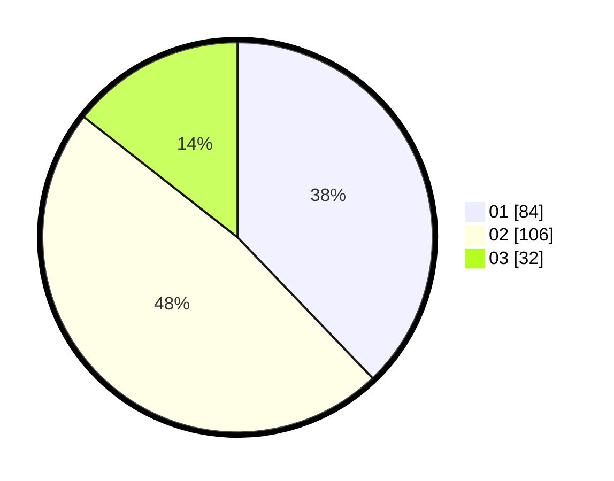

# Hasil

Hasil perolehan suara paslon dapat dilihat pada file paslon-01.txt, paslon-02.txt, dan paslon-03.txt.

Jika tidak ada, artinya data tersebut belum ada pada SIREKAP.

## Perolehan Suara

 * Paslon 01: **84**.
 * Paslon 02: **106**.
 * Paslon 03: **32**.

## Foto C Plano

https://sirekap-obj-formc.kpu.go.id/2b3e/pemilu/ppwp/31/74/09/10/03/3174091003024-20240217-113000--bc0abeb7-2057-44d2-a4e4-aaeb3e874af0.jpg

https://sirekap-obj-formc.kpu.go.id/2b3e/pemilu/ppwp/31/74/09/10/03/3174091003024-20240217-104640--9d6cde7d-d854-4abb-bf0f-bd7f3626d001.jpg

https://sirekap-obj-formc.kpu.go.id/2b3e/pemilu/ppwp/31/74/09/10/03/3174091003024-20240217-105211--8bba8b10-a74c-4830-b2f2-998abcb3a4d3.jpg

## DATA PEMILIH TETAP

Jumlah pemilih dalam DPT: **225**.
 * L: **104**.
 * P: **121**.

## DATA PENGGUNA HAK PILIH

Jumlah pengguna hak pilih dalam DPT: **224**.
 * L: **103**.
 * P: **121**.

Jumlah pengguna hak pilih dalam DPTb: **1**.
 * L: **1**.
 * P: **0**.

Jumlah pengguna hak pilih dalam DPK: **0**.
 * L: **0**.
 * P: **0**.

Jumlah pengguna hak pilih: **225**.
 * L: **104**.
 * P: **121**.

## JUMLAH SUARA SAH DAN TIDAK SAH

JUMLAH SELURUH SUARA SAH: **222**.

JUMLAH SUARA TIDAK SAH: **3**.

JUMLAH SELURUH SUARA SAH DAN SUARA TIDAK SAH: **225**.
