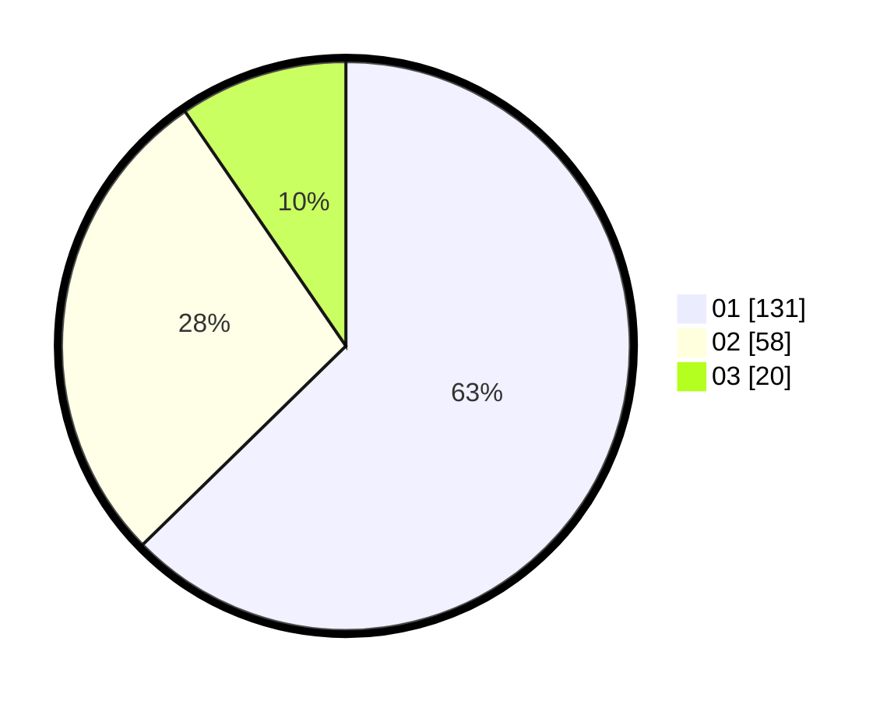

# Hasil

Hasil perolehan suara paslon dapat dilihat pada file paslon-01.txt, paslon-02.txt, dan paslon-03.txt.

Jika tidak ada, artinya data tersebut belum ada pada SIREKAP.

## Perolehan Suara

 * Paslon 01: **131**.
 * Paslon 02: **58**.
 * Paslon 03: **20**.

## Foto C Plano

https://sirekap-obj-formc.kpu.go.id/f216/pemilu/ppwp/31/74/09/10/03/3174091003025-20240215-032929--bcd366d2-97ea-4843-bc6d-15f1da46c610.jpg

https://sirekap-obj-formc.kpu.go.id/f216/pemilu/ppwp/31/74/09/10/03/3174091003025-20240215-012818--359d8321-28df-49ea-9df9-7df5993a8e68.jpg

https://sirekap-obj-formc.kpu.go.id/f216/pemilu/ppwp/31/74/09/10/03/3174091003025-20240215-012822--9d303e9b-4bec-49cd-a98a-c40d84510e91.jpg

## DATA PEMILIH TETAP

Jumlah pemilih dalam DPT: **269**.
 * L: **132**.
 * P: **137**.

## DATA PENGGUNA HAK PILIH

Jumlah pengguna hak pilih dalam DPT: **207**.
 * L: **98**.
 * P: **109**.

Jumlah pengguna hak pilih dalam DPTb: **3**.
 * L: **2**.
 * P: **1**.

Jumlah pengguna hak pilih dalam DPK: **1**.
 * L: **0**.
 * P: **1**.

Jumlah pengguna hak pilih: **211**.
 * L: **100**.
 * P: **111**.

## JUMLAH SUARA SAH DAN TIDAK SAH

JUMLAH SELURUH SUARA SAH: **209**.

JUMLAH SUARA TIDAK SAH: **2**.

JUMLAH SELURUH SUARA SAH DAN SUARA TIDAK SAH: **211**.
