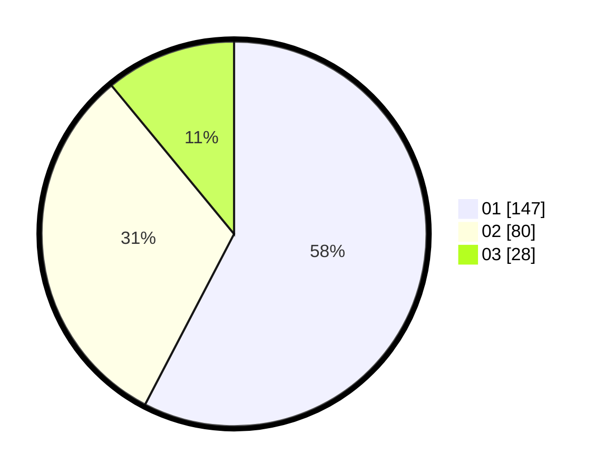

# Hasil

Hasil perolehan suara paslon dapat dilihat pada file paslon-01.txt, paslon-02.txt, dan paslon-03.txt.

Jika tidak ada, artinya data tersebut belum ada pada SIREKAP.

## Perolehan Suara

 * Paslon 01: **147**.
 * Paslon 02: **80**.
 * Paslon 03: **28**.

## Foto C Plano

https://sirekap-obj-formc.kpu.go.id/0787/pemilu/ppwp/31/74/09/10/03/3174091003031-20240214-195352--3b2ad9c0-edab-449b-bea5-d93fa65e2199.jpg

https://sirekap-obj-formc.kpu.go.id/0787/pemilu/ppwp/31/74/09/10/03/3174091003031-20240214-195412--da37fb0f-be45-4d8c-b868-ff079890058f.jpg

https://sirekap-obj-formc.kpu.go.id/0787/pemilu/ppwp/31/74/09/10/03/3174091003031-20240214-195428--30fef101-c679-4ba3-90da-98d08a1710c2.jpg

## DATA PEMILIH TETAP

Jumlah pemilih dalam DPT: **297**.
 * L: **149**.
 * P: **148**.

## DATA PENGGUNA HAK PILIH

Jumlah pengguna hak pilih dalam DPT: **254**.
 * L: **121**.
 * P: **133**.

Jumlah pengguna hak pilih dalam DPTb: **2**.
 * L: **0**.
 * P: **2**.

Jumlah pengguna hak pilih dalam DPK: **2**.
 * L: **1**.
 * P: **1**.

Jumlah pengguna hak pilih: **258**.
 * L: **122**.
 * P: **136**.

## JUMLAH SUARA SAH DAN TIDAK SAH

JUMLAH SELURUH SUARA SAH: **255**.

JUMLAH SUARA TIDAK SAH: **3**.

JUMLAH SELURUH SUARA SAH DAN SUARA TIDAK SAH: **258**.
