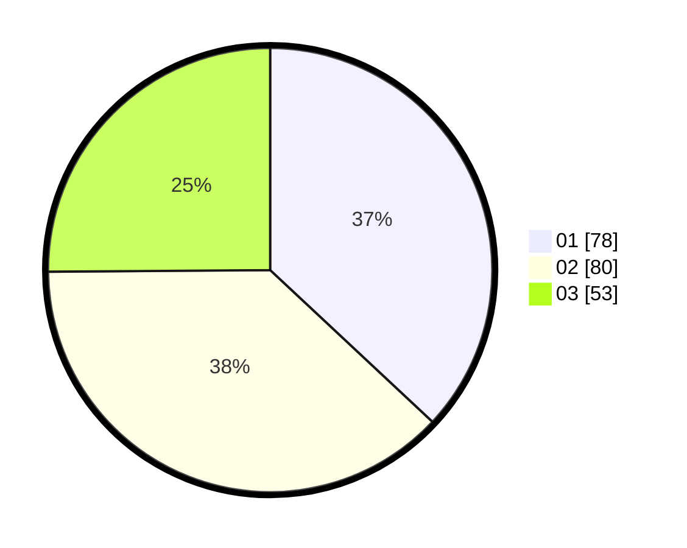

# Hasil

Hasil perolehan suara paslon dapat dilihat pada file paslon-01.txt, paslon-02.txt, dan paslon-03.txt.

Jika tidak ada, artinya data tersebut belum ada pada SIREKAP.

## Perolehan Suara

 * Paslon 01: **78**.
 * Paslon 02: **80**.
 * Paslon 03: **53**.

## Foto C Plano

https://sirekap-obj-formc.kpu.go.id/b050/pemilu/ppwp/31/74/09/10/03/3174091003046-20240214-222248--5df1869e-e80b-4116-90c3-2e26340c6f7b.jpg

https://sirekap-obj-formc.kpu.go.id/b050/pemilu/ppwp/31/74/09/10/03/3174091003046-20240214-155431--08dd2bb2-03e7-4860-9e9f-7e1e7fbc6dd2.jpg

https://sirekap-obj-formc.kpu.go.id/b050/pemilu/ppwp/31/74/09/10/03/3174091003046-20240214-210400--2317a5d7-26d8-4101-afde-c5dd8b70e725.jpg

## DATA PEMILIH TETAP

Jumlah pemilih dalam DPT: **270**.
 * L: **128**.
 * P: **142**.

## DATA PENGGUNA HAK PILIH

Jumlah pengguna hak pilih dalam DPT: **214**.
 * L: **100**.
 * P: **114**.

Jumlah pengguna hak pilih dalam DPTb: **0**.
 * L: **0**.
 * P: **0**.

Jumlah pengguna hak pilih dalam DPK: **2**.
 * L: **1**.
 * P: **1**.

Jumlah pengguna hak pilih: **216**.
 * L: **101**.
 * P: **115**.

## JUMLAH SUARA SAH DAN TIDAK SAH

JUMLAH SELURUH SUARA SAH: **211**.

JUMLAH SUARA TIDAK SAH: **5**.

JUMLAH SELURUH SUARA SAH DAN SUARA TIDAK SAH: **216**.
