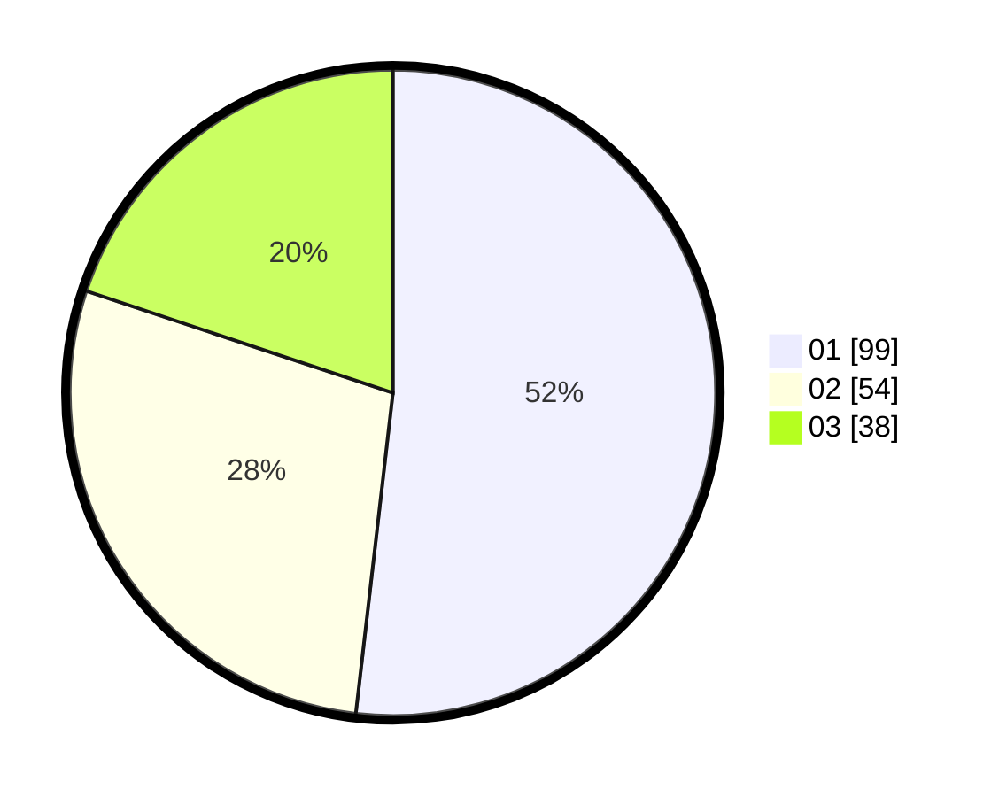

# Hasil

Hasil perolehan suara paslon dapat dilihat pada file paslon-01.txt, paslon-02.txt, dan paslon-03.txt.

Jika tidak ada, artinya data tersebut belum ada pada SIREKAP.

## Perolehan Suara

 * Paslon 01: **99**.
 * Paslon 02: **54**.
 * Paslon 03: **38**.

## Foto C Plano

https://sirekap-obj-formc.kpu.go.id/cafb/pemilu/ppwp/31/74/09/10/03/3174091003049-20240214-231156--66fe12ad-9615-45e1-b9d2-cfe70c0d60a7.jpg

https://sirekap-obj-formc.kpu.go.id/cafb/pemilu/ppwp/31/74/09/10/03/3174091003049-20240214-231322--fd8bd95c-f246-48ed-b1d8-3cc8a8422037.jpg

https://sirekap-obj-formc.kpu.go.id/cafb/pemilu/ppwp/31/74/09/10/03/3174091003049-20240214-224910--87094182-feb7-4ddd-aca8-1e7689b65f07.jpg

## DATA PEMILIH TETAP

Jumlah pemilih dalam DPT: **228**.
 * L: **105**.
 * P: **123**.

## DATA PENGGUNA HAK PILIH

Jumlah pengguna hak pilih dalam DPT: **201**.
 * L: **92**.
 * P: **109**.

Jumlah pengguna hak pilih dalam DPTb: **0**.
 * L: **0**.
 * P: **0**.

Jumlah pengguna hak pilih dalam DPK: **1**.
 * L: **1**.
 * P: **0**.

Jumlah pengguna hak pilih: **202**.
 * L: **93**.
 * P: **109**.

## JUMLAH SUARA SAH DAN TIDAK SAH

JUMLAH SELURUH SUARA SAH: **191**.

JUMLAH SUARA TIDAK SAH: **11**.

JUMLAH SELURUH SUARA SAH DAN SUARA TIDAK SAH: **202**.
