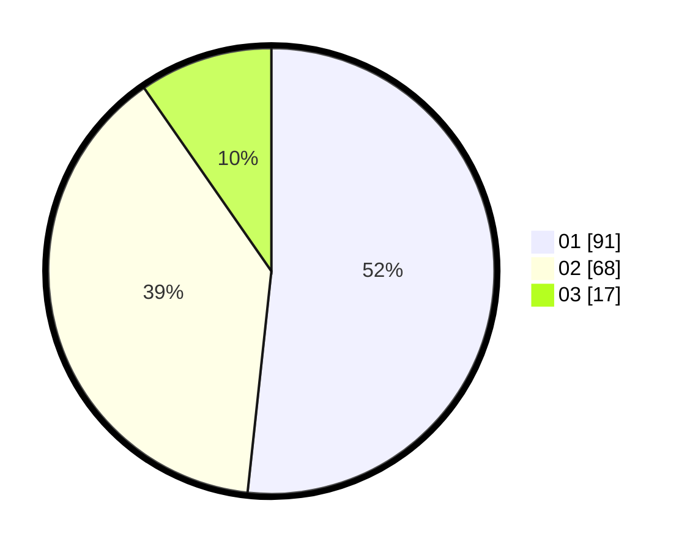

# Hasil

Hasil perolehan suara paslon dapat dilihat pada file paslon-01.txt, paslon-02.txt, dan paslon-03.txt.

Jika tidak ada, artinya data tersebut belum ada pada SIREKAP.

## Perolehan Suara

 * Paslon 01: **91**.
 * Paslon 02: **68**.
 * Paslon 03: **17**.

## Foto C Plano

https://sirekap-obj-formc.kpu.go.id/c3d4/pemilu/ppwp/31/74/09/10/03/3174091003059-20240214-194840--310c6c5c-6114-4a67-8752-8e29a9c32721.jpg

https://sirekap-obj-formc.kpu.go.id/c3d4/pemilu/ppwp/31/74/09/10/03/3174091003059-20240216-195202--6c08d034-dc73-4aed-974d-e76f184c9e34.jpg

https://sirekap-obj-formc.kpu.go.id/c3d4/pemilu/ppwp/31/74/09/10/03/3174091003059-20240214-200019--461e329b-ba5e-42d0-993b-73cdec2ea975.jpg

## DATA PEMILIH TETAP

Jumlah pemilih dalam DPT: **231**.
 * L: **112**.
 * P: **119**.

## DATA PENGGUNA HAK PILIH

Jumlah pengguna hak pilih dalam DPT: **180**.
 * L: **86**.
 * P: **94**.

Jumlah pengguna hak pilih dalam DPTb: **0**.
 * L: **0**.
 * P: **0**.

Jumlah pengguna hak pilih dalam DPK: **0**.
 * L: **0**.
 * P: **0**.

Jumlah pengguna hak pilih: **180**.
 * L: **86**.
 * P: **94**.

## JUMLAH SUARA SAH DAN TIDAK SAH

JUMLAH SELURUH SUARA SAH: **176**.

JUMLAH SUARA TIDAK SAH: **4**.

JUMLAH SELURUH SUARA SAH DAN SUARA TIDAK SAH: **180**.
