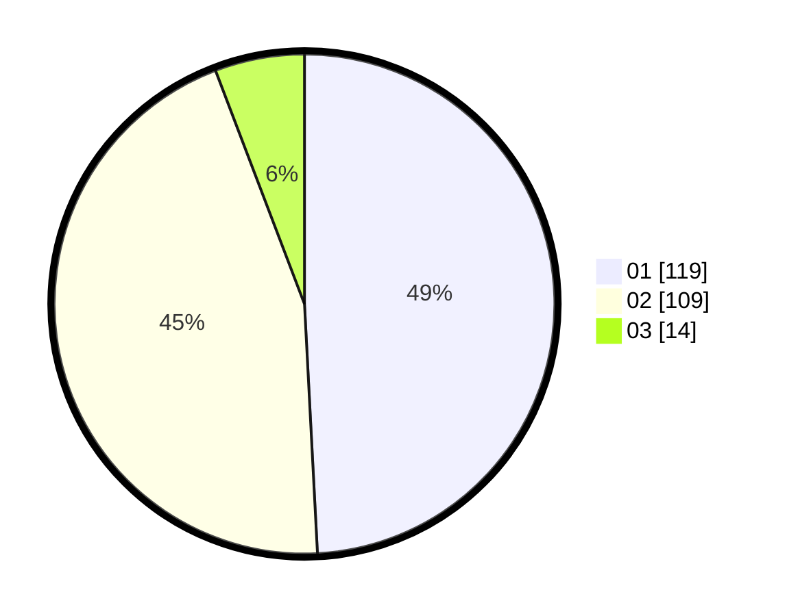

# Hasil

Hasil perolehan suara paslon dapat dilihat pada file paslon-01.txt, paslon-02.txt, dan paslon-03.txt.

Jika tidak ada, artinya data tersebut belum ada pada SIREKAP.

## Perolehan Suara

 * Paslon 01: **119**.
 * Paslon 02: **109**.
 * Paslon 03: **14**.

## Foto C Plano

https://sirekap-obj-formc.kpu.go.id/18cb/pemilu/ppwp/31/74/09/10/03/3174091003068-20240214-160139--5359bb6c-af35-4496-96dc-6a7af4c618e0.jpg

https://sirekap-obj-formc.kpu.go.id/18cb/pemilu/ppwp/31/74/09/10/03/3174091003068-20240214-200737--af099726-de06-4696-8971-9891387331b3.jpg

https://sirekap-obj-formc.kpu.go.id/18cb/pemilu/ppwp/31/74/09/10/03/3174091003068-20240214-201050--7adb7d60-2e9e-4950-bf98-9e3984764352.jpg

## DATA PEMILIH TETAP

Jumlah pemilih dalam DPT: **298**.
 * L: **157**.
 * P: **141**.

## DATA PENGGUNA HAK PILIH

Jumlah pengguna hak pilih dalam DPT: **247**.
 * L: **125**.
 * P: **122**.

Jumlah pengguna hak pilih dalam DPTb: **0**.
 * L: **0**.
 * P: **0**.

Jumlah pengguna hak pilih dalam DPK: **2**.
 * L: **1**.
 * P: **1**.

Jumlah pengguna hak pilih: **249**.
 * L: **126**.
 * P: **123**.

## JUMLAH SUARA SAH DAN TIDAK SAH

JUMLAH SELURUH SUARA SAH: **242**.

JUMLAH SUARA TIDAK SAH: **7**.

JUMLAH SELURUH SUARA SAH DAN SUARA TIDAK SAH: **249**.
