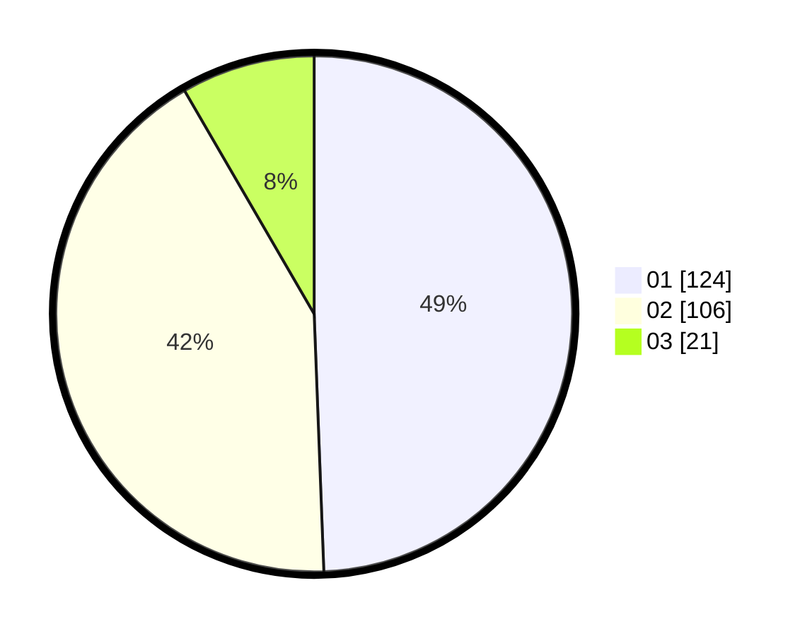

# Hasil

Hasil perolehan suara paslon dapat dilihat pada file paslon-01.txt, paslon-02.txt, dan paslon-03.txt.

Jika tidak ada, artinya data tersebut belum ada pada SIREKAP.

## Perolehan Suara

 * Paslon 01: **124**.
 * Paslon 02: **106**.
 * Paslon 03: **21**.

## Foto C Plano

https://sirekap-obj-formc.kpu.go.id/deae/pemilu/ppwp/31/74/09/10/03/3174091003075-20240214-160139--eab953e0-442a-4ba4-9381-772767a0c06d.jpg

https://sirekap-obj-formc.kpu.go.id/deae/pemilu/ppwp/31/74/09/10/03/3174091003075-20240214-160147--6dc6a9f5-356d-4eea-a225-f3deb3060fab.jpg

https://sirekap-obj-formc.kpu.go.id/deae/pemilu/ppwp/31/74/09/10/03/3174091003075-20240214-160151--588c3481-f8a9-4f56-b886-17ca0155ad54.jpg

## DATA PEMILIH TETAP

Jumlah pemilih dalam DPT: **286**.
 * L: **138**.
 * P: **148**.

## DATA PENGGUNA HAK PILIH

Jumlah pengguna hak pilih dalam DPT: **242**.
 * L: **117**.
 * P: **125**.

Jumlah pengguna hak pilih dalam DPTb: **8**.
 * L: **4**.
 * P: **4**.

Jumlah pengguna hak pilih dalam DPK: **2**.
 * L: **1**.
 * P: **1**.

Jumlah pengguna hak pilih: **252**.
 * L: **122**.
 * P: **130**.

## JUMLAH SUARA SAH DAN TIDAK SAH

JUMLAH SELURUH SUARA SAH: **251**.

JUMLAH SUARA TIDAK SAH: **1**.

JUMLAH SELURUH SUARA SAH DAN SUARA TIDAK SAH: **252**.
