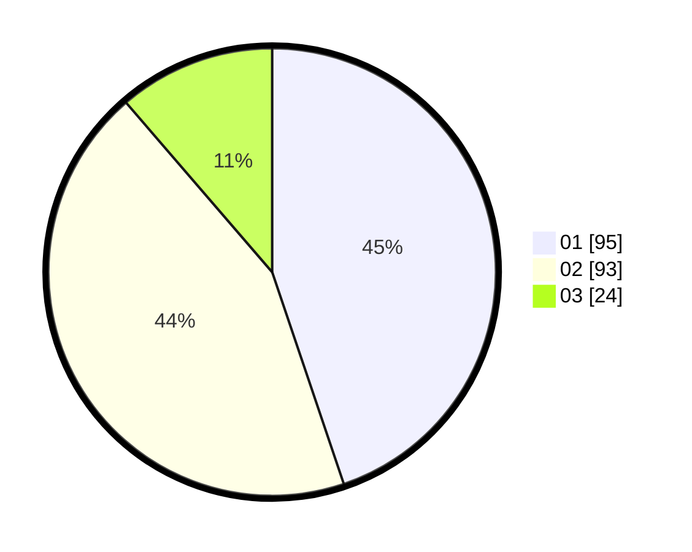

# Hasil

Hasil perolehan suara paslon dapat dilihat pada file paslon-01.txt, paslon-02.txt, dan paslon-03.txt.

Jika tidak ada, artinya data tersebut belum ada pada SIREKAP.

## Perolehan Suara

 * Paslon 01: **95**.
 * Paslon 02: **93**.
 * Paslon 03: **24**.

## Foto C Plano

https://sirekap-obj-formc.kpu.go.id/802c/pemilu/ppwp/31/74/09/10/03/3174091003078-20240214-221431--e9cb2b46-e3b5-48aa-8bdb-6cafb5328ed7.jpg

https://sirekap-obj-formc.kpu.go.id/802c/pemilu/ppwp/31/74/09/10/03/3174091003078-20240214-141004--aabac431-365f-4a5e-afca-3fdf58b1c0e5.jpg

https://sirekap-obj-formc.kpu.go.id/802c/pemilu/ppwp/31/74/09/10/03/3174091003078-20240214-221222--687ee903-f7ae-4121-9801-1b8d96c49def.jpg
