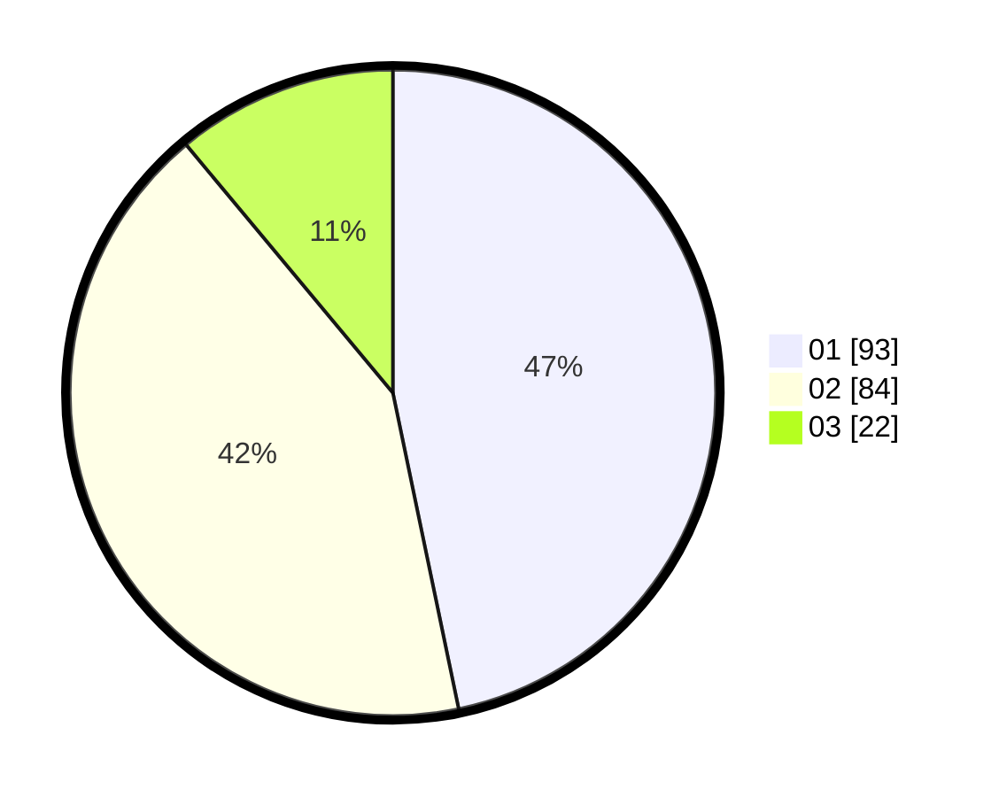

# Hasil

Hasil perolehan suara paslon dapat dilihat pada file paslon-01.txt, paslon-02.txt, dan paslon-03.txt.

Jika tidak ada, artinya data tersebut belum ada pada SIREKAP.

## Perolehan Suara

 * Paslon 01: **93**.
 * Paslon 02: **84**.
 * Paslon 03: **22**.

## Foto C Plano

https://sirekap-obj-formc.kpu.go.id/7180/pemilu/ppwp/31/74/09/10/03/3174091003086-20240214-185444--312d4efa-592c-45e2-b171-49320669dda6.jpg

https://sirekap-obj-formc.kpu.go.id/7180/pemilu/ppwp/31/74/09/10/03/3174091003086-20240214-185450--415762f4-0fdb-44ab-aad2-3c36a8d1a513.jpg

https://sirekap-obj-formc.kpu.go.id/7180/pemilu/ppwp/31/74/09/10/03/3174091003086-20240214-185455--1196f47c-fcc5-41a9-a07b-5a81a4fc4cd0.jpg

## DATA PEMILIH TETAP

Jumlah pemilih dalam DPT: **259**.
 * L: **139**.
 * P: **120**.

## DATA PENGGUNA HAK PILIH

Jumlah pengguna hak pilih dalam DPT: **200**.
 * L: **99**.
 * P: **101**.

Jumlah pengguna hak pilih dalam DPTb: **1**.
 * L: **1**.
 * P: **0**.

Jumlah pengguna hak pilih dalam DPK: **4**.
 * L: **2**.
 * P: **2**.

Jumlah pengguna hak pilih: **205**.
 * L: **102**.
 * P: **103**.

## JUMLAH SUARA SAH DAN TIDAK SAH

JUMLAH SELURUH SUARA SAH: **199**.

JUMLAH SUARA TIDAK SAH: **6**.

JUMLAH SELURUH SUARA SAH DAN SUARA TIDAK SAH: **205**.
