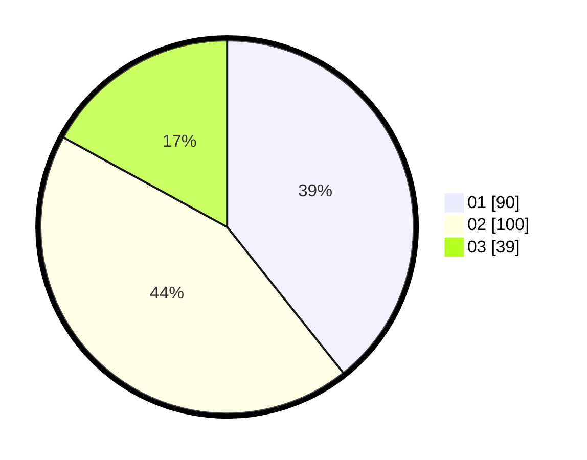

# Hasil

Hasil perolehan suara paslon dapat dilihat pada file paslon-01.txt, paslon-02.txt, dan paslon-03.txt.

Jika tidak ada, artinya data tersebut belum ada pada SIREKAP.

## Perolehan Suara

 * Paslon 01: **90**.
 * Paslon 02: **100**.
 * Paslon 03: **39**.

## Foto C Plano

https://sirekap-obj-formc.kpu.go.id/d040/pemilu/ppwp/31/74/09/10/03/3174091003091-20240214-190159--bd522799-d67b-4552-9a9e-b132bd8274fa.jpg

https://sirekap-obj-formc.kpu.go.id/d040/pemilu/ppwp/31/74/09/10/03/3174091003091-20240214-190024--e98626f5-d1db-4709-92f3-57fc54d1936b.jpg

https://sirekap-obj-formc.kpu.go.id/d040/pemilu/ppwp/31/74/09/10/03/3174091003091-20240214-192455--646ba766-8352-48dc-b960-a5e4a1200fa9.jpg

## DATA PEMILIH TETAP

Jumlah pemilih dalam DPT: **276**.
 * L: **140**.
 * P: **136**.

## DATA PENGGUNA HAK PILIH

Jumlah pengguna hak pilih dalam DPT: **227**.
 * L: **109**.
 * P: **118**.

Jumlah pengguna hak pilih dalam DPTb: **2**.
 * L: **1**.
 * P: **1**.

Jumlah pengguna hak pilih dalam DPK: **3**.
 * L: **2**.
 * P: **1**.

Jumlah pengguna hak pilih: **232**.
 * L: **112**.
 * P: **120**.

## JUMLAH SUARA SAH DAN TIDAK SAH

JUMLAH SELURUH SUARA SAH: **229**.

JUMLAH SUARA TIDAK SAH: **3**.

JUMLAH SELURUH SUARA SAH DAN SUARA TIDAK SAH: **232**.
